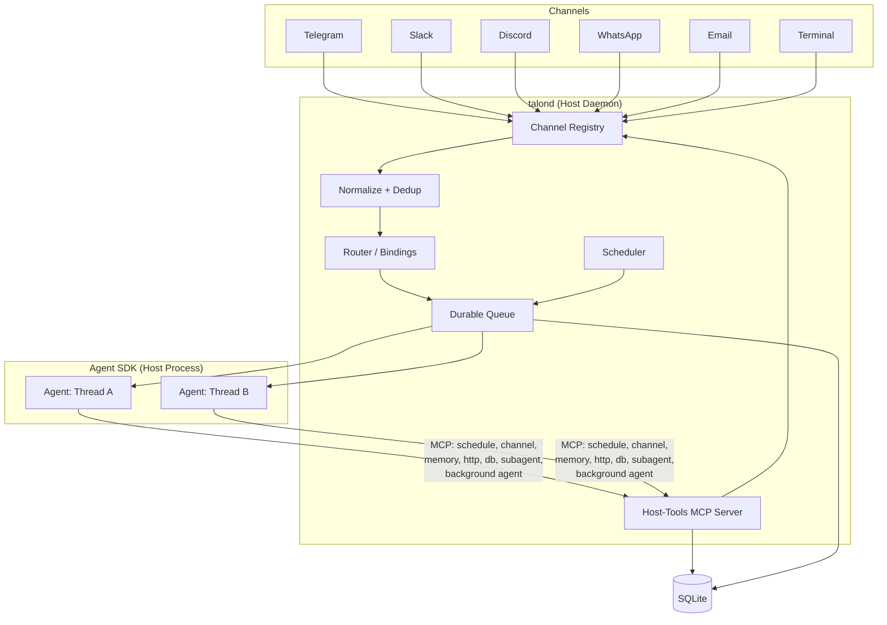
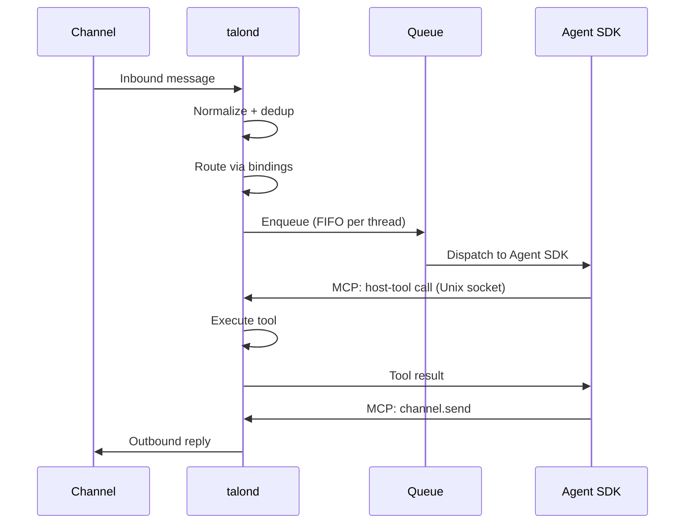
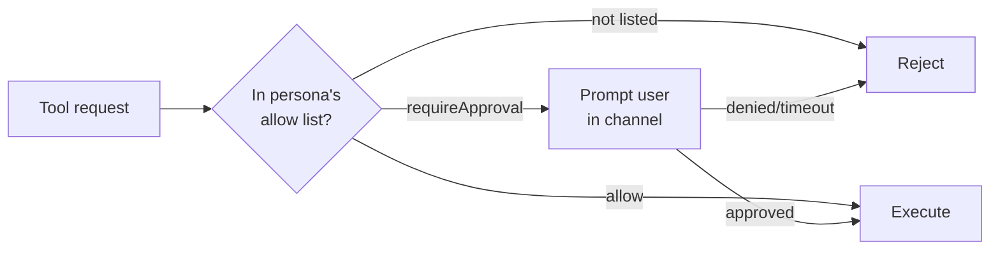
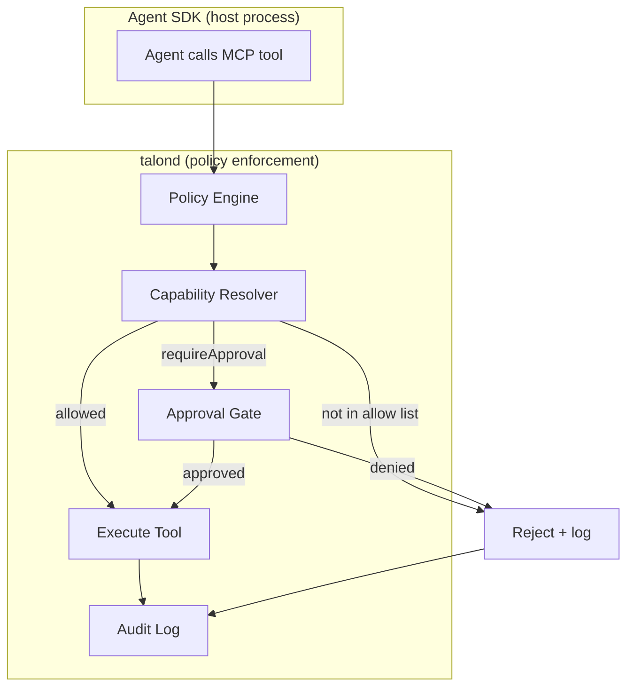
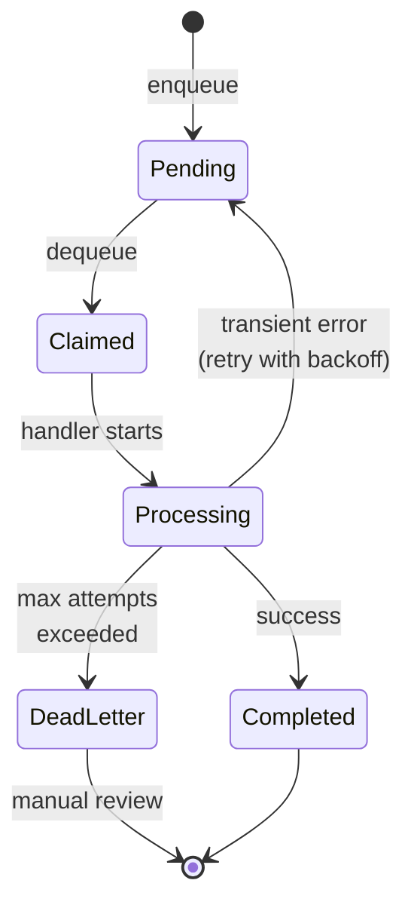

<p align="center">
    
  </p>

# Talon

**Resilient, secure, extensible autonomous agent daemon.**

[](#testing)
[](https://nodejs.org)
[](LICENSE)
[](https://www.typescriptlang.org)

---

## What is Talon?

Talon is a self-hosted daemon that orchestrates autonomous AI agents across multiple communication channels. You configure personas — each with their own system prompt, tools, and security policy — and bind them to channels like Telegram, Slack, Discord, WhatsApp, or email. Messages flow in, get routed to the right persona, processed by the Claude Agent SDK, and responses flow back out.

It is built for single-user or small-team deployments where you want persistent, always-on AI agents that you fully control — no cloud platform, no vendor lock-in, just a daemon on your server.

### Why Talon?

- **Self-hosted**: runs on your own hardware, your data stays with you
- **Resilient**: durable message queue survives crashes, automatic retry with exponential backoff, dead-letter handling
- **Secure**: capability-based access control — every tool call is policy-checked and audit-logged
- **Multi-channel**: one daemon handles Telegram, Slack, Discord, WhatsApp, email, and terminal simultaneously
- **Multi-persona**: different agents with different personalities, tools, and permissions on different channels

---

## Features

### Channels

- **Telegram** — Long polling with MarkdownV2 formatting
- **Slack** — Socket Mode with mrkdwn formatting
- **Terminal** — WebSocket server with `talonctl chat` client, rendered markdown output, persistent threads
- **Discord** — Gateway events with REST API, rate limit handling _(inbound not yet implemented)_
- **WhatsApp** — Cloud API with webhook inbound _(inbound not yet implemented)_
- **Email** — IMAP polling + SMTP send, thread tracking via In-Reply-To headers _(not yet tested)_

### Agent System

- **Persona-per-channel** — Each channel gets its own agent with a dedicated system prompt, model, tools, and capabilities
- **Claude Agent SDK** — Agents run via the Anthropic Agent SDK with session persistence and multi-turn support
- **Per-thread memory** — Each conversation thread gets its own workspace with transcript, working memory, and artifacts
- **Skills** — Modular prompt fragments and tool bundles that snap onto personas
- **MCP integration** — Connect external MCP tool servers via stdio, policy-enforced through host-tools bridge

### Provider abstraction

Agent execution is decoupled from any specific SDK or CLI. A provider layer sits between the daemon core and the actual model runtime, so swapping or adding providers doesn't require changes to the runner, queue, or context management.

Each provider implements a small interface: prepare a background CLI invocation, parse its output, estimate context usage, and create an SDK execution strategy. The daemon resolves which provider to use from config, both for the main agent runner and for background agents independently. Claude Code ships as the default (and currently only) provider.

This matters because it means you can:

- Run different providers for foreground vs background work (e.g., Claude for interactive, a local model for batch tasks)
- Add new providers without touching core pipeline code — implement the interface, register in config, done
- Configure provider-specific settings like context window size and rotation thresholds per provider instance
- Keep backward compatibility — existing configs without provider sections still work, the loader normalizes them

```yaml
agentRunner:
  defaultProvider: claude-code
  providers:
    claude-code:
      enabled: true
      command: claude
      contextWindowTokens: 200000
      rotationThreshold: 0.5

backgroundAgent:
  enabled: true
  maxConcurrent: 3
  defaultProvider: claude-code
  providers:
    claude-code:
      enabled: true
      command: claude
      contextWindowTokens: 200000
```

### Infrastructure

- **Durable queue** — SQLite-backed message queue with crash recovery, retry, and dead-letter
- **Scheduler** — Agent-managed cron, interval, and one-shot scheduled tasks
- **Host-tools MCP bridge** — 7 built-in tools (schedule, channel, memory, http, db, subagent, background agent) exposed via Unix socket
- **Sub-agent system** — Route mechanical LLM tasks (summarization, memory grooming, search) to cheap models via pluggable sub-agents
- **Background agents** — Launch long-running Claude Code workers for deep tasks without blocking the foreground conversation
- **Hot reload** — Change config, personas, and skills without restarting the daemon
- **Systemd integration** — Watchdog heartbeat, graceful shutdown, timer-based wake-only mode
- **Session persistence** — Agent sessions resume across messages in the same thread
- **Rolling context window** — Automatic session rotation when context usage hits a configurable ratio of the provider's context window, with compressed history injection into fresh sessions

### Security

- **Default-deny capabilities** — Tools are gated by capability labels (`channel.send`, `schedule.manage`, etc.)
- **Approval gates** — High-risk actions prompt for user approval in-channel before executing
- **Secrets management** — Credentials via `${ENV_VAR}` substitution, never hardcoded in config
- **Audit logging** — Every side-effecting operation recorded with full provenance

---

## Architecture

The daemon receives messages from channels, routes them through a durable queue, and dispatches them to the Claude Agent SDK. Agents interact with the host via MCP host-tools exposed over a Unix socket.



### Message Flow



---

## Quick Start

### Prerequisites

- **Node.js 22+**
- **Claude Max subscription** or **Anthropic API key**
- **SQLite** (ships with better-sqlite3, no separate install)

### Install

```bash
git clone https://github.com/ivo-toby/talon.git
cd talon
npm install
npm run build
```

### First-Time Setup

```bash
# Run interactive setup — checks environment, creates directories, generates config
npx talonctl setup

# Add a Telegram channel
npx talonctl add-channel --name my-telegram --type telegram

# Add a persona
npx talonctl add-persona --name assistant

# Run database migrations
npx talonctl migrate

# Check everything is ready
npx talonctl doctor
```

### Start the Daemon

```bash
# Direct
node dist/index.js --config talond.yaml

# Or via npm
npm run talond
```

---

## Configuration

Talon uses a single YAML configuration file. A fully annotated example ships at [`talond.yaml.example`](talond.yaml.example).

### Minimal Configuration

```yaml
storage:
  type: sqlite
  path: data/talond.sqlite

queue:
  maxAttempts: 3
  backoffBaseMs: 1000
  backoffMaxMs: 60000
  concurrencyLimit: 5

backgroundAgent:
  enabled: true
  maxConcurrent: 3
  defaultTimeoutMinutes: 30
  claudePath: claude

personas:
  - name: assistant
    model: claude-sonnet-4-6
    systemPromptFile: personas/assistant/system.md
    skills: []
    subagents:
      - session-summarizer
      - memory-groomer
      - memory-retriever
      - file-searcher
    capabilities:
      allow:
        - channel.send:telegram
        - fs.read:*
        - memory.access:*
        - subagent.invoke:*
        - subagent.background
      requireApproval:
        - fs.write:workspace
    maxConcurrent: 2

channels:
  - name: my-telegram
    type: telegram
    enabled: true
    config:
      token: ${TELEGRAM_BOT_TOKEN}
      allowedUserIds:
        - 123456789
      pollIntervalMs: 1000

scheduler:
  tickIntervalMs: 5000

auth:
  mode: subscription
  providers:
    anthropic:
      apiKey: ${SUBAGENT_ANTHROPIC_API_KEY}
    openai:
      apiKey: ${OPENAI_API_KEY}

context:
  thresholdTokens: 80000  # legacy fallback if provider rotationThreshold is omitted
  recentMessageCount: 10

logLevel: info
dataDir: data
```

### Configuration Sections

| Section                | Purpose                                                                       |
| ---------------------- | ----------------------------------------------------------------------------- |
| `storage`              | Database backend and SQLite path                                              |
| `queue`                | Retry/backoff/concurrency controls for durable queue processing               |
| `backgroundAgent`      | Enable and tune long-running background Claude Code workers                   |
| `personas`             | Persona profiles: model, system prompt, skills, capabilities                  |
| `channels`             | Channel connector entries with `type`, `name`, and connector `config` payload |
| `bindings`             | Channel-to-persona routing with default persona per channel                   |
| `schedules`            | Agent-managed schedule entries (cron, interval, one-shot)                     |
| `scheduler`            | Scheduler tick interval                                                       |
| `auth`                 | `subscription` or `api_key` authentication mode                               |
| `context`              | Rolling context window: legacy threshold fallback and verbatim message count  |
| `logLevel` / `dataDir` | Runtime logging level and data root                                           |

### Environment Variable Substitution

Credential fields support `${ENV_VAR}` syntax so you never hardcode secrets:

```yaml
channels:
  - name: my-telegram
    type: telegram
    config:
      botToken: ${TELEGRAM_BOT_TOKEN}
```

---

### Background Agent Workers

Talon includes a `background_agent` host tool for work that should keep running after the foreground turn returns. Typical examples are repo-wide refactors, large code searches, or longer research/coding tasks that should not block the active conversation.

This was added because Talon already had two extremes:

- the normal foreground agent turn, which is interactive and should stay responsive
- short synchronous sub-agents, which are useful for mechanical delegation but intentionally limited

Some tasks need the full Claude Code CLI runtime and the persona's prompt + external MCP context, but they should still run out-of-band. Background agents fill that gap: the foreground agent starts a worker, gets a task ID immediately, and Talon tracks the worker to completion in SQLite.

The lifecycle is durable:

- Talon persists task state in the database
- the daemon enforces a concurrency limit
- completion, failure, timeout, and cancellation are recorded
- the originating thread gets a normal completion message through the existing queue and channel-send path

Background workers intentionally do **not** get Talon's own host-tools MCP server. They inherit the persona prompt and external MCP servers from assigned skills, but they cannot recursively spawn more background jobs or directly send messages from the detached process.

#### Configuration

```yaml
backgroundAgent:
  enabled: true
  maxConcurrent: 3
  defaultTimeoutMinutes: 30
  claudePath: claude
```

| Option | Meaning |
| --- | --- |
| `enabled` | Globally enable or disable background workers |
| `maxConcurrent` | Maximum number of background Claude workers allowed at once |
| `defaultTimeoutMinutes` | Default wall-clock timeout when a tool call does not provide one |
| `claudePath` | Executable path used to launch the Claude Code CLI |

To let a persona use the feature, grant `subagent.background`:

```yaml
personas:
  - name: assistant
    capabilities:
      allow:
        - subagent.background
```

---

## Channel Connectors

Each connector implements the `ChannelConnector` interface: `start()`, `stop()`, `onMessage()`, `send()`, and `format()`. All connectors convert Markdown output to channel-native formatting automatically.

### Telegram

Long-polling connector using the Telegram Bot API.

```yaml
channels:
  - name: my-telegram
    type: telegram
    enabled: true
    config:
      botToken: ${TELEGRAM_BOT_TOKEN}
      pollingTimeoutSec: 30
      allowedChatIds:
        - 123456789
```

- **Inbound**: Long polling via `getUpdates`
- **Outbound**: `sendMessage` with MarkdownV2 parse mode
- **Idempotency key**: `update_id`
- **Thread mapping**: `chat_id`

### Slack

Event-driven connector for Slack's Events API or Socket Mode.

```yaml
channels:
  - name: my-slack
    type: slack
    enabled: true
    config:
      botToken: ${SLACK_BOT_TOKEN}
      appToken: ${SLACK_APP_TOKEN}
      signingSecret: ${SLACK_SIGNING_SECRET}
```

- **Inbound**: Events API webhooks or Socket Mode
- **Outbound**: `chat.postMessage` Web API
- **Idempotency key**: `event_id` > `client_msg_id` > `channel:ts`
- **Thread mapping**: `channel_id:thread_ts`
- **Format**: Slack mrkdwn (`*bold*`, `_italic_`, `` `code` ``)

### Discord

> **Not yet implemented**: The connector has send support and a `feedEvent()` ingestion method, but no Gateway WebSocket client to actually receive events from Discord. Needs a Gateway client similar to the Slack Socket Mode implementation. See TASK-043.

Push-based connector using the Discord Gateway and REST API.

```yaml
channels:
  - name: my-discord
    type: discord
    enabled: true
    config:
      botToken: ${DISCORD_BOT_TOKEN}
      applicationId: '123456789'
      allowedChannelIds:
        - '987654321'
```

- **Inbound**: Gateway `MESSAGE_CREATE` events
- **Outbound**: REST API `POST /channels/{id}/messages`
- **Idempotency key**: Message snowflake ID
- **Thread mapping**: `channel_id:message_id`
- **Rate limiting**: Automatic retry with `Retry-After` header handling

### WhatsApp

> **Not yet implemented**: The connector has send support and a `feedWebhook()` ingestion method, but no HTTP webhook server to receive events from the WhatsApp Cloud API. Needs a webhook endpoint that proxies incoming POST requests to `feedWebhook()`. See TASK-067.

Webhook-based connector using the WhatsApp Cloud API.

```yaml
channels:
  - name: my-whatsapp
    type: whatsapp
    enabled: true
    config:
      phoneNumberId: '123456789'
      accessToken: ${WHATSAPP_ACCESS_TOKEN}
      verifyToken: ${WHATSAPP_VERIFY_TOKEN}
```

- **Inbound**: Webhook events via `feedWebhook()`
- **Outbound**: Cloud API `POST /{phone_number_id}/messages`
- **Idempotency key**: `message_id`
- **Format**: WhatsApp-flavored markdown

### Email

> **Not yet tested**: The connector has IMAP polling and SMTP send implementations, but has not been tested end-to-end. See TASK-049.

Dual-mode connector with IMAP polling and SMTP outbound.

```yaml
channels:
  - name: my-email
    type: email
    enabled: true
    config:
      imapHost: imap.gmail.com
      imapPort: 993
      imapUser: agent@example.com
      imapPass: ${EMAIL_PASSWORD}
      imapSecure: true
      smtpHost: smtp.gmail.com
      smtpPort: 587
      smtpUser: agent@example.com
      smtpPass: ${EMAIL_PASSWORD}
      smtpSecure: false
      fromAddress: 'Talon <agent@example.com>'
```

- **Inbound**: IMAP polling (or webhook via `feedInbound()`)
- **Outbound**: SMTP with HTML formatting
- **Idempotency key**: `Message-ID` header
- **Thread mapping**: `In-Reply-To` / `References` headers
- **Format**: Markdown to HTML conversion

### Terminal

WebSocket-based connector for direct CLI access to any persona. Connect from any machine with `talonctl chat`.

```yaml
channels:
  - name: my-terminal
    type: terminal
    enabled: true
    config:
      port: 7700
      host: 0.0.0.0
      token: ${TERMINAL_TOKEN}
```

- **Inbound**: WebSocket JSON messages from `talonctl chat`
- **Outbound**: JSON response over WebSocket, client renders with `marked-terminal`
- **Auth**: Shared token with constant-time comparison, 64KB max payload, 10s auth timeout
- **Thread mapping**: `clientId` — same client always gets the same conversation thread
- **Persona override**: `--persona` flag switches persona at connect time
- **Format**: Raw markdown passthrough (client handles rendering)

#### Connecting

```bash
# Set token via env var or --token flag
export TERMINAL_TOKEN=your-secret-token

# Connect to a running Talon instance
talonctl chat --host 10.0.1.95 --port 7700 --persona assistant

# Or with explicit token
talonctl chat --host 10.0.1.95 --port 7700 --token your-secret-token

# Custom client ID for persistent thread identity
talonctl chat --host 10.0.1.95 --port 7700 --client-id my-laptop
```

The client provides:

- Rendered markdown output via `marked-terminal`
- Typing spinner (`ora`) while the agent works
- Persistent conversation — reconnecting with the same `clientId` resumes the thread
- Graceful disconnect on Ctrl+C

---

## Personas

A persona defines an AI agent's identity, capabilities, and channel bindings. Bindings are managed separately via `talonctl bind`.

```yaml
personas:
  - name: alfred
    description: Personal assistant
    model: claude-sonnet-4-6
    systemPromptFile: personas/alfred/system.md
    skills:
      - web-search
      - calendar
    capabilities:
      allow:
        - channel.send:telegram
        - channel.send:slack
        - net.http
        - schedule.manage
        - memory.access
      requireApproval:
        - db.query

bindings:
  - persona: alfred
    channel: my-telegram
    isDefault: true
  - persona: alfred
    channel: my-slack
    isDefault: true
```

### Capability Labels

Tools are gated by scoped capability labels. Capabilities are listed in `allow` or `requireApproval` arrays — anything not listed is denied by default.

| Capability               | Description                             |
| ------------------------ | --------------------------------------- |
| `channel.send:<channel>` | Send messages to a specific channel     |
| `schedule.manage`        | Create/modify/delete scheduled tasks    |
| `memory.access`          | Read/write per-thread structured memory |
| `net.http`               | Fetch external URLs                     |
| `db.query`               | Execute read-only database queries      |
| `subagent.invoke`        | Invoke sub-agents for delegated tasks   |
| `subagent.background`    | Launch and manage background workers    |

### Capability Resolution

When an agent requests a tool:



---

## Skills

Skills are modular bundles of prompts, tools, and configuration that snap onto personas.

### Skill Structure

```
skills/<skill_name>/
  skill.yaml          # metadata, required capabilities, config schema
  prompts/*.md        # persona augmentation fragments
  tools/*.yaml        # tool manifests (capability labels + schemas)
  mcp/*.json          # MCP server definitions (optional)
  migrations/*.sql    # DB migrations (optional)
```

### Adding a Skill

```bash
# Scaffold a new skill and attach it to a persona
npx talonctl add-skill --name web-search --persona assistant
```

This creates the skill directory structure, generates a default `skill.yaml`, and adds the skill to the persona in `talond.yaml`.

### Skill Resolution

Persona capabilities and skill requirements are intersected at runtime:

```
granted = persona.capabilities ∩ skill.requiredCapabilities
```

Skills with unmet capabilities produce a warning at startup and are skipped.

---

## Sub-Agents

### Why Sub-Agents?

The main agent (Claude Sonnet) is powerful but expensive. Many tasks it performs are mechanical — searching files, retrieving memories, grooming stale data, summarizing transcripts. These don't need Sonnet-level reasoning; a cheaper model like Haiku can handle them in a fraction of the cost and time.

Sub-agents solve this by offloading specific, well-scoped tasks to cheap models. The main agent stays focused on conversation and decision-making, while sub-agents handle the grunt work and return structured results. This keeps per-message costs low without sacrificing capability.

### How Sub-Agents Work

1. The main agent calls `subagent_invoke` via MCP, specifying a sub-agent name and input
2. The daemon validates that the persona is assigned this sub-agent and has the required capabilities
3. The **ModelResolver** creates a Vercel AI SDK model instance for the sub-agent's configured provider
4. The sub-agent's `run()` function executes with a system prompt, model, and injected services
5. Results flow back to the main agent as structured data

Sub-agents are loaded from three locations at startup (later overrides earlier):

1. **Built-in** (`dist/subagents/default/`) — ships with the daemon
2. **Project-level** (`cwd()/subagents/`) — custom agents in the project directory
3. **Data directory** (`dataDir/subagents/`) — deployment-specific agents

### Sub-Agent Structure

```
src/subagents/default/<agent_name>/    # built-in agents (compiled with daemon)
  subagent.yaml          # manifest: model, capabilities, timeout
  index.ts               # entry point: run(ctx, input) -> Result<SubAgentResult>
  prompts/*.md           # system prompt fragments (concatenated in order)
  lib/                   # optional helper modules
```

### Built-in Sub-Agents

#### `file-searcher`

**Problem:** The main agent has no filesystem access outside its sandbox. When a user asks "find my notes about deployment," the agent would need to read every file itself — slow, expensive, and context-heavy.

**Solution:** Uses a cascading search backend (`rg` → `grep` → Node.js `readdir`/`readFile`) to find matches by content, then optionally ranks results with an LLM when there are too many hits. Returns ranked file paths with relevant snippets.

|                           |                                                                           |
| ------------------------- | ------------------------------------------------------------------------- |
| **Model**                 | Haiku 4.5                                                                 |
| **Required capabilities** | `fs.read:*`                                                               |
| **Timeout**               | 30s                                                                       |
| **Input**                 | `{ query, rootPaths?, extensions?, maxFileSize?, maxResultsWithoutLlm? }` |
| **Output**                | Ranked list of `{ path, snippet, relevance }`                             |

The search cascade tries `rg --json` first (fastest, with `--ignore-case`, `--max-filesize`, context lines), falls back to `grep -rni` if rg isn't installed, and finally to a pure Node.js implementation as a last resort. If fewer than 20 matches are found, they're returned directly without LLM ranking.

#### `memory-retriever`

**Problem:** As threads accumulate memory items (facts, summaries, notes), finding the right ones for context becomes a search problem. Loading all memories into the main agent's context is wasteful when only a few are relevant.

**Solution:** Reads all memory items for the current thread, applies a keyword pre-filter, then uses an LLM to rank the remaining candidates by relevance to the query. Returns the top-K results with relevance scores and reasoning.

|                           |                                                           |
| ------------------------- | --------------------------------------------------------- |
| **Model**                 | Haiku 4.5                                                 |
| **Required capabilities** | `memory.access:*`                                         |
| **Timeout**               | 30s                                                       |
| **Input**                 | `{ query, topK?, threshold? }`                            |
| **Output**                | Ranked list of `{ id, type, content, relevance, reason }` |

If fewer than 10 keyword matches are found, they're returned directly without LLM ranking. The LLM filters out items with relevance below 0.3.

#### `memory-groomer`

**Problem:** Memory items accumulate over time — duplicates, outdated facts, superseded summaries. Without grooming, context assembly pulls in stale data that confuses the main agent.

**Solution:** Reads memory items for the current thread (optionally filtered by time window), sends them to an LLM that classifies each as `prune` (delete), `consolidate` (merge duplicates into one), or `keep`. Executes the recommended actions against the database. Consolidation inserts the merged entry before deleting sources to prevent data loss.

|                           |                                                                 |
| ------------------------- | --------------------------------------------------------------- |
| **Model**                 | Haiku 4.5                                                       |
| **Required capabilities** | `memory.access:*`                                               |
| **Timeout**               | 30s                                                             |
| **Input**                 | `{ periodMs? }` (optional: only groom items from the last N ms) |
| **Output**                | `{ pruned, consolidated, kept }` counts                         |

Uses `generateObject` with a Zod discriminated union schema to ensure the LLM returns valid, typed actions.

#### `session-summarizer`

**Problem:** Long conversations consume context window space. When the agent resumes a thread, it needs the key facts without replaying the entire transcript.

**Solution:** Takes a raw conversation transcript and compresses it into a structured summary using `generateObject` with a Zod schema. Returns key facts (important decisions and information), open threads (unresolved topics), and a narrative summary.

|                           |                                                                  |
| ------------------------- | ---------------------------------------------------------------- |
| **Model**                 | Haiku 4.5                                                        |
| **Required capabilities** | none                                                             |
| **Timeout**               | 30s                                                              |
| **Input**                 | `{ transcript }`                                                 |
| **Output**                | `{ keyFacts: string[], openThreads: string[], summary: string }` |

This sub-agent is called automatically by the **rolling context window** (see below) — it is not invoked manually by the agent.

### Rolling Context Window

Long conversations eventually fill the Agent SDK's context window. Talon monitors `cacheReadTokens` after each agent run and automatically rotates the session when usage exceeds 80K tokens, keeping conversations seamless without jarring resets.

**How it works:**

```
Agent run completes → cacheReadTokens > 80K?
  ├── No  → Continue normally (session resumes next time)
  └── Yes → ContextRoller triggers:
            1. Reconstruct transcript from messages table
            2. Call session-summarizer (cheap model, ~30s)
            3. Store summary as memory item (type: 'summary')
            4. Clear session → next run starts fresh
                               ↓
            ContextAssembler injects into fresh session:
            ┌─────────────────────────────────────┐
            │ ## Previous Context                  │
            │ [Latest session summary]             │
            │ ### Recent Messages                  │
            │ [Last 10 messages verbatim]          │
            └─────────────────────────────────────┘
```

**Key design decisions:**

- **80K threshold** — leaves headroom for current turn I/O (~10-20K) within Sonnet's 200K window. Fresh sessions start at ~10-15K, giving ~70K of organic conversation before the next rotation.
- **Summaries are memory items** — stored as `memory_items` with type `summary`, so they're subject to `memory-groomer` consolidation. Old summaries get merged/pruned automatically.
- **Daemon-side, not agent-side** — the agent never knows its session was rotated. Context injection happens in the system prompt before the agent sees its first message.
- **Awaited, not fire-and-forget** — rotation completes before the next queue item is processed, preventing race conditions.
- **Prompt injection mitigation** — injected historical content is prefixed with a read-only disclaimer to prevent user messages from being treated as instructions.

**Files:** `src/daemon/context-roller.ts`, `src/daemon/context-assembler.ts`

### Provider Support

Sub-agents can use any supported AI provider. Configure API keys in `talond.yaml`:

```yaml
auth:
  providers:
    anthropic:
      apiKey: ${SUBAGENT_ANTHROPIC_API_KEY}
    openai:
      apiKey: ${OPENAI_API_KEY}
    google:
      apiKey: ${GOOGLE_API_KEY}
    ollama:
      baseURL: http://localhost:11434/v1
```

### Persona Configuration

Personas must declare which sub-agents they can invoke and have the `subagent.invoke:*` capability:

```yaml
personas:
  - name: assistant
    model: claude-sonnet-4-6
    subagents:
      - session-summarizer
      - memory-groomer
      - memory-retriever
      - file-searcher
    capabilities:
      allow:
        - subagent.invoke:*
        - memory.access:*
        - fs.read:*
```

The agent also needs to know about its sub-agents in the system prompt. Add a section describing the available sub-agents and their input schemas so the agent knows when and how to use them.

### Testing Sub-Agents

Use `talonctl run-subagent` to test sub-agents without a running daemon:

```bash
# File search (no DB needed)
npx talonctl run-subagent --name file-searcher --input '{"query": "deployment"}'

# Session summarizer (no DB needed)
npx talonctl run-subagent --name session-summarizer --input '{"transcript": "User: hello\nAssistant: hi"}'

# memory-retriever and memory-groomer require a running daemon (they need DB access)
```

### Creating a Custom Sub-Agent

1. Create a directory under `subagents/` (in cwd or dataDir) with a `subagent.yaml` manifest
2. Write an `index.ts` (dev) or `index.js` (production) with an exported `run(ctx, input)` function returning `Result<SubAgentResult, SubAgentError>`
3. Add prompt fragments in `prompts/` (numbered for ordering: `01-system.md`, `02-examples.md`)
4. Declare required capabilities in the manifest — the daemon validates these against the persona at invocation time
5. Test with `talonctl run-subagent --name your-agent --input '{}'`

Custom sub-agents override built-in ones if they share the same name (dataDir takes precedence over cwd, which takes precedence over built-in).

---

## CLI Reference

`talonctl` is the management CLI for the daemon. All commands are available via `npx talonctl <command>`.

### Daemon Management

| Command           | Description                                                   |
| ----------------- | ------------------------------------------------------------- |
| `talonctl status` | Show daemon health, active channels, queue depth, token usage |
| `talonctl reload` | Hot-reload config without restarting the daemon               |
| `talonctl chat`   | Connect to a persona via the terminal channel                 |

```bash
# Check daemon status
npx talonctl status --timeout 5000

# Reload configuration
npx talonctl reload
```

### Setup and Configuration

| Command                                       | Description                                                                       |
| --------------------------------------------- | --------------------------------------------------------------------------------- |
| `talonctl setup`                              | First-time interactive setup (checks environment, creates dirs, generates config) |
| `talonctl add-channel --name <n> --type <t>`  | Add a channel connector to config                                                 |
| `talonctl add-persona --name <n>`             | Scaffold a persona directory and add to config                                    |
| `talonctl add-skill --name <n> --persona <p>` | Scaffold a skill and attach to a persona                                          |

```bash
# Full setup flow
npx talonctl setup --config talond.yaml --data-dir data
npx talonctl add-channel --name work-slack --type slack
npx talonctl add-persona --name researcher
npx talonctl add-skill --name web-search --persona researcher
```

### Channel & Persona Management

| Command                                       | Description                                                            |
| --------------------------------------------- | ---------------------------------------------------------------------- |
| `talonctl list-channels`                      | List all configured channels                                           |
| `talonctl list-personas`                      | List all configured personas                                           |
| `talonctl list-skills`                        | List all configured skills across personas                             |
| `talonctl bind --persona <p> --channel <c>`   | Bind a persona to a channel (first binding becomes default)            |
| `talonctl unbind --persona <p> --channel <c>` | Remove a persona-channel binding                                       |
| `talonctl remove-channel --name <n>`          | Remove a channel and its bindings                                      |
| `talonctl remove-persona --name <n>`          | Remove a persona, its directory, and bindings                          |
| `talonctl add-mcp --name <n> --command <cmd>` | Add an MCP server to a persona                                         |
| `talonctl env-check`                          | Audit config for `${ENV_VAR}` placeholders and report missing env vars |
| `talonctl config-show`                        | Display resolved config with secrets masked                            |

```bash
# List what's configured
npx talonctl list-channels
npx talonctl list-personas
npx talonctl list-skills

# Bind a persona to a channel
npx talonctl bind --persona assistant --channel my-telegram

# Remove a channel (cascades to bindings)
npx talonctl remove-channel --name old-slack

# Add an MCP server to a persona
npx talonctl add-mcp --name web-search --persona assistant \
  --command npx --args @anthropic-ai/mcp-web-search --transport stdio

# Check for missing environment variables
npx talonctl env-check

# Show resolved config (secrets masked)
npx talonctl config-show
```

### Sub-Agent Testing

| Command                                           | Description                                      |
| ------------------------------------------------- | ------------------------------------------------ |
| `talonctl run-subagent --name <n> --input <json>` | Invoke a sub-agent directly (no daemon required) |

```bash
# Test the session-summarizer
npx talonctl run-subagent --name session-summarizer \
  --input '{"transcript": "User: Hi\nAssistant: Hello!"}'

# Test the memory-retriever
npx talonctl run-subagent --name memory-retriever \
  --input '{"query": "deployment steps"}'

# Use a custom subagents directory
npx talonctl run-subagent --name my-agent --input '{}' --subagents-dir ./subagents
```

### Database and Operations

| Command                | Description                                                    |
| ---------------------- | -------------------------------------------------------------- |
| `talonctl migrate`     | Apply pending database migrations                              |
| `talonctl backup`      | Snapshot SQLite database and data directory                    |
| `talonctl doctor`      | Run diagnostic checks on environment, config, and dependencies |
| `talonctl queue-purge` | Purge queue items by status                                    |

```bash
# Run migrations
npx talonctl migrate --config talond.yaml

# Create a backup
npx talonctl backup --config talond.yaml --output /backups/talon-$(date +%Y%m%d).tar.gz

# Check system health
npx talonctl doctor --config talond.yaml

# Purge completed, pending, and failed queue items (default)
npx talonctl queue-purge

# Purge specific statuses
npx talonctl queue-purge --statuses dead_letter,failed

# Purge ALL queue items including in-flight (claimed, processing)
npx talonctl queue-purge --all
```

### Doctor Checks

`talonctl doctor` runs 7 structured checks:

1. **OS compatibility** — Verifies Linux or macOS
2. **Node.js version** — Checks for Node 22+
3. **Docker availability** — Verifies Docker is installed and running
4. **Directory structure** — Ensures data directories exist
5. **Config file** — Validates `talond.yaml` syntax and schema
6. **Database migrations** — Checks for pending migrations
7. **Config validation** — Deep validation of personas, channels, and references

---

## Deployment

Talon supports three deployment modes.

### 1. Native Daemon (systemd)

The recommended mode for Linux servers. The daemon runs as a systemd service with automatic restart on failure.

```bash
# Install the service (detects user, directory, and node path)
sudo ./deploy/install-service.sh

# Or with explicit options
sudo ./deploy/install-service.sh --user talon --dir /home/talon/talon

# Start the daemon
sudo systemctl start talond

# Check status and follow logs
sudo systemctl status talond
journalctl -u talond -f

# The daemon will auto-start on boot and restart on crash
```

The install script generates a systemd unit from `deploy/talond.service` with your paths substituted. It reads environment variables from `.env` in the project root via `EnvironmentFile`.

The service includes security hardening: `NoNewPrivileges`, `PrivateTmp`, `ProtectKernelTunables`, `SystemCallFilter=@system-service`, `RestrictAddressFamilies`, and more.

### 2. Containerized Daemon (Docker)

> **Coming soon** — Docker deployment is under active development. The goal is to run the Agent SDK inside Docker containers for blast-radius isolation against prompt injection from untrusted input (repos, emails, messages). The host-mode path will remain as fallback. Dockerfiles and Compose config exist in `deploy/` and will be updated for the current architecture.

### 3. Wake-Only Mode (Timer)

For low-traffic deployments. A systemd timer wakes the daemon periodically to process the queue, then exits.

```bash
sudo cp deploy/talond-wake.service /etc/systemd/system/
sudo cp deploy/talond.timer /etc/systemd/system/

sudo systemctl daemon-reload
sudo systemctl enable talond.timer
sudo systemctl start talond.timer
```

Default: wakes every 5 minutes. Adjust `OnUnitActiveSec` in `talond.timer`.

### Deployment Files

| File                                                       | Purpose                                           |
| ---------------------------------------------------------- | ------------------------------------------------- |
| [`deploy/talond.service`](deploy/talond.service)           | systemd service unit template                     |
| [`deploy/install-service.sh`](deploy/install-service.sh)   | Install script (generates unit, enables service)  |
| [`deploy/Dockerfile`](deploy/Dockerfile)                   | Multi-stage talond container image (node:22-slim) |
| [`deploy/Dockerfile.sandbox`](deploy/Dockerfile.sandbox)   | Agent sandbox image with SDK runtime              |
| [`deploy/docker-compose.yaml`](deploy/docker-compose.yaml) | Example Compose setup                             |
| [`deploy/talond.timer`](deploy/talond.timer)               | systemd timer (wake-only mode)                    |
| [`deploy/talond-wake.service`](deploy/talond-wake.service) | systemd oneshot for timer-triggered wake          |

---

## Security Model

Talon implements defense in depth through capability-based access control, host-mediated side effects, and audit logging. Docker container isolation for agent sandboxing is coming soon — wrapping Agent SDK execution in containers with network access limited to `api.anthropic.com` for defense-in-depth against prompt injection.

### Host-Tools MCP Bridge

Agents interact with the host through 5 MCP tools exposed over a Unix socket. The daemon mediates all side effects — agents cannot access channels, databases, or the network directly.

| Tool              | Purpose                             |
| ----------------- | ----------------------------------- |
| `schedule_manage` | CRUD + list scheduled tasks (supports `promptFile` for reusable prompts) |
| `channel_send`    | Send messages to channel connectors |
| `memory_access`   | Read/write per-thread memory        |
| `net_http`        | Fetch external URLs                 |
| `db_query`        | Read-only database queries          |
| `subagent_invoke` | Invoke a sub-agent by name          |

### Capability System



Every MCP tool call goes through:

1. **Policy Engine** — Validates the tool exists and maps to a capability label
2. **Capability Resolver** — Checks the persona's `allow` or `requireApproval` lists
3. **Approval Gate** — For `requireApproval` capabilities, prompts the user in-channel
4. **Audit Log** — Records the decision and result regardless of outcome

### Database Query Isolation

Agents can query the database via the `db.query` tool, but are constrained by five independent security layers:

| Layer                     | Mechanism                                                                   | What it prevents                                              |
| ------------------------- | --------------------------------------------------------------------------- | ------------------------------------------------------------- |
| 1. Regex pre-check        | Rejects non-SELECT statements and forbidden keywords (INSERT, DROP, etc.)   | Write operations via SQL                                      |
| 2. Table whitelist        | Only 4 approved tables (`memory_items`, `schedules`, `messages`, `threads`) | Access to sensitive tables (personas, audit_log, queue_items) |
| 3. Thread/persona scoping | Auto-injects `WHERE thread_id = ? AND persona_id = ?` clauses               | Cross-tenant data leakage between personas or threads         |
| 4. Row limit              | Hard cap at 1,000 rows per query                                            | Resource exhaustion via large result sets                     |
| 5. Read-only connection   | Separate SQLite connection opened with `{ readonly: true }`                 | Any write operation, even if all other layers are bypassed    |

Complex SQL patterns (UNION, subqueries, CTEs, INTERSECT, EXCEPT) are rejected to prevent whitelist bypass via query composition. User-supplied WHERE conditions are wrapped in parentheses to prevent OR-based scoping escapes.

### Secrets Management

- Credentials use `${ENV_VAR}` substitution in `talond.yaml` — never hardcoded
- Environment variables loaded from `.env` file at startup
- `talonctl config-show` masks all secret values in output
- `talonctl env-check` audits for missing environment variables

### Approval Gates

High-risk capabilities can require interactive user approval:

```yaml
capabilities:
  allow:
    - channel.send:telegram
    - memory.access
  requireApproval:
    - db.query # prompts user in-channel before executing
```

Approval prompts are sent to the originating channel with a configurable timeout.

---

## Durable Queue

The message queue is the backbone of Talon's resilience. Every inbound message is persisted to SQLite before processing begins.



- **Crash recovery**: On restart, in-flight items (status `claimed` or `processing`) are reset to `pending`
- **FIFO per thread**: Messages within a thread are processed in order, no interleaving
- **Cross-thread parallelism**: Different threads process concurrently up to `max_concurrent_containers`
- **Exponential backoff**: Failed items retry with configurable base delay (1s), max delay (60s), and jitter
- **Dead-letter queue**: After max attempts (default 3), items move to dead-letter for manual review

---

## Memory System

Each conversation thread gets a persistent workspace:

```
data/threads/<thread_id>/
  memory/          # human-editable notes (CLAUDE.md, etc.)
  attachments/     # ingested inbound files
  artifacts/       # agent output files
  ipc/
    input/         # host -> container messages
    output/        # container -> host messages
    errors/        # failed IPC messages
```

### Memory Layers

| Layer             | Storage                | Purpose                                         |
| ----------------- | ---------------------- | ----------------------------------------------- |
| Transcript        | `messages` table       | Canonical message log, never rewritten          |
| Working memory    | In-prompt context      | Recent message window included in agent prompts |
| Thread notebook   | Filesystem (`memory/`) | Human-editable per-thread notes                 |
| Structured memory | `memory_items` table   | Extracted facts and summaries                   |

Memory writes are gated by persona capabilities. Thread notebooks persist across container restarts.

---

## Scheduling

Schedules are managed by agents at runtime via the `schedule_manage` MCP tool — agents can create, update, delete, and list their own scheduled tasks. Scheduled tasks flow through the same queue and routing system as regular messages.

```yaml
# Config only sets the tick interval — schedules are agent-managed
scheduler:
  tickIntervalMs: 5000
```

Agents create schedules like:

```
"Schedule a daily briefing at 8am: cron 0 8 * * *"
"Check system health every 30 minutes"
```

| Schedule Type | Example     | Behavior                     |
| ------------- | ----------- | ---------------------------- |
| Cron          | `0 9 * * *` | Fires at 09:00 daily         |
| Interval      | `30m`       | Recurring at fixed intervals |
| One-shot      | (future)    | Single execution at set time |

Scheduled tasks are enqueued through the standard queue pipeline, subject to the same retry and dead-letter policies as regular messages. Cron expressions evaluate in system local time.

### Task Prompt Files

Schedules can reference reusable prompt files stored in a persona's `prompts/` directory instead of embedding prompt text inline. This keeps long or complex prompts version-controlled and editable without touching the schedule itself.

```
personas/
  assistant/
    system.md
    personality/
      01-tone.md
    prompts/               # task prompt files
      morning-briefing.md
      weekly-review.md
```

When creating a schedule, use `promptFile` (the filename without `.md`) instead of `prompt`:

```
"Create a schedule at 8am weekdays using the morning-briefing prompt file"
```

The tool call uses `promptFile` in place of `prompt` — they are mutually exclusive:

```json
{
  "action": "create",
  "cronExpr": "0 8 * * 1-5",
  "label": "Morning briefing",
  "promptFile": "morning-briefing"
}
```

Prompt files are read on demand when the schedule fires, so edits to the file take effect on the next execution without restarting the daemon. The `talonctl add-persona` command scaffolds an empty `prompts/` directory alongside the `personality/` folder.

---

## MCP Integration

Talon supports the [Model Context Protocol](https://modelcontextprotocol.io) for connecting external tool servers to personas. MCP servers are added per-persona via `talonctl add-mcp`.

```bash
# Add an MCP server to a persona
npx talonctl add-mcp --name web-search --persona assistant \
  --command npx --args @anthropic-ai/mcp-web-search --transport stdio

# Add a custom MCP server
npx talonctl add-mcp --name my-tools --persona assistant \
  --command node --args ./tools/server.js --transport stdio
```

This adds the MCP server to the persona's config in `talond.yaml`:

```yaml
personas:
  - name: assistant
    mcpServers:
      - name: web-search
        command: npx
        args: ['@anthropic-ai/mcp-web-search']
        transport: stdio
```

MCP servers are passed through to the Agent SDK at runtime. Each persona gets its own set of MCP servers.

---

## Token Usage Tracking

When using Anthropic API keys, Talon records token usage from Agent SDK results in the `runs` table:

- Input tokens, output tokens, cache read/write tokens per run
- `total_cost_usd` from Agent SDK results

Per-persona budget limits and a `talonctl usage` report command are planned (TASK-047).

---

## Development

### Build

```bash
npm install
npm run build          # TypeScript -> dist/
```

### Test

```bash
npm test               # Run all tests
npm run test:watch     # Watch mode
npm run test:coverage  # Coverage report (80% target)
```

The test suite includes:

- **Unit tests** — Every module, repository, connector, and CLI command
- **Integration tests** — IPC round-trips, queue durability, channel registry lifecycle
- **End-to-end tests** — Full message flow from inbound to outbound with real SQLite

### Lint and Format

```bash
npm run lint           # ESLint with TypeScript strict rules
npm run format         # Prettier
```

### Dev Server

```bash
npm run dev            # tsx watch mode with auto-reload
```

---

## Project Structure

```
talon/
  config/
    talond.yaml.example          # Annotated example configuration
  deploy/
    Dockerfile                   # talond container image
    Dockerfile.sandbox           # Agent sandbox image
    docker-compose.yaml          # Example Compose setup
    talond.service               # systemd service unit
    talond.timer                 # systemd timer (wake-only)
    talond-wake.service          # Oneshot service for timer wake
  src/
    channels/
      connectors/
        telegram/                # Telegram Bot API connector
        slack/                   # Slack Events API connector
        discord/                 # Discord Gateway + REST connector
        whatsapp/                # WhatsApp Cloud API connector
        email/                   # IMAP + SMTP connector
        terminal/                # WebSocket terminal connector
      channel-registry.ts        # Connector lifecycle management
      channel-router.ts          # Thread -> persona routing
      channel-types.ts           # ChannelConnector interface
    cli/
      commands/                  # talonctl subcommands
      index.ts                   # CLI entry point (commander)
    collaboration/
      supervisor.ts              # Multi-agent supervisor
      worker-manager.ts          # Worker sandbox orchestration
    core/
      config/                    # YAML loader + Zod schemas
      database/
        migrations/              # Versioned SQL migrations
        repositories/            # Repository pattern (12 repos)
        connection.ts            # SQLite connection factory
      errors/                    # TalonError hierarchy (16 error types)
      logging/                   # pino logger + audit logger
      types/                     # Result helpers, common types
    daemon/
      daemon.ts                  # TalondDaemon orchestrator
      lifecycle.ts               # PID file, crash recovery
      signal-handler.ts          # SIGTERM/SIGINT handling
      watchdog.ts                # systemd watchdog heartbeat
    ipc/
      ipc-writer.ts              # Atomic file write
      ipc-reader.ts              # Directory poll + validate
      ipc-channel.ts             # Bidirectional IPC channel
      daemon-ipc-server.ts       # talond <-> talonctl IPC
    mcp/
      mcp-proxy.ts               # MCP tool proxy
      mcp-registry.ts            # MCP server registry
    memory/
      memory-manager.ts          # Memory read/write/delete
      thread-workspace.ts        # Per-thread filesystem layout
      context-builder.ts         # Prompt context assembly
    personas/
      persona-loader.ts          # Load + validate personas
      capability-merger.ts       # Persona x skill capability resolution
    pipeline/
      message-normalizer.ts      # Inbound message normalization
      message-pipeline.ts        # Normalize -> dedup -> route -> enqueue
    queue/
      queue-manager.ts           # Queue lifecycle + processing loop
      queue-processor.ts         # Item processing with retry
      retry-strategy.ts          # Exponential backoff with jitter
      dead-letter.ts             # Dead-letter queue management
    sandbox/
      sandbox-manager.ts         # Agent lifecycle management
      agent-runner.ts            # Agent SDK query dispatch
      session-tracker.ts         # Session resume tracking
    scheduler/
      scheduler.ts               # Tick-based schedule processor
      cron-evaluator.ts          # Cron expression evaluation
    skills/
      skill-loader.ts            # Load + validate skills
      skill-resolver.ts          # Skill -> persona resolution
    subagents/
      subagent-types.ts          # Core type definitions
      subagent-schema.ts         # Zod manifest validation
      subagent-loader.ts         # Load sub-agents from directories
      model-resolver.ts          # Vercel AI SDK provider factory
      subagent-runner.ts         # Execution engine with timeout
      index.ts                   # Barrel export
      default/                   # Built-in sub-agents
        session-summarizer/      # Transcript compression
        memory-groomer/          # Memory consolidation
        memory-retriever/        # Memory search + LLM reranking
        file-searcher/           # File search (rg/grep/node cascade)
    tools/
      host-tools/                # Host-side tool handlers
        channel-send.ts          # Send via channel connector
        http-proxy.ts            # Fetch with domain allowlist
        memory-access.ts         # Thread memory CRUD
        schedule-manage.ts       # Schedule CRUD
        db-query.ts              # Read-only DB queries
        subagent-invoke.ts       # Invoke sub-agents
      tool-registry.ts           # Tool manifest registry
      policy-engine.ts           # Capability-based access control
      capability-resolver.ts     # Label resolution
      approval-gate.ts           # In-channel approval prompting
    usage/
      token-tracker.ts           # Token usage recording + aggregation
  tests/
    unit/                        # Unit tests (mirrors src/ structure)
    integration/                 # Integration + e2e tests
```

---

## Data Model

Talon uses SQLite with WAL mode and foreign keys. All persistence goes through the repository pattern for future Postgres portability.

### Tables

| Table          | Purpose                                                         |
| -------------- | --------------------------------------------------------------- |
| `channels`     | Channel connector configurations                                |
| `personas`     | Agent profiles and capabilities                                 |
| `bindings`     | Channel+thread to persona routing                               |
| `threads`      | Conversation thread metadata                                    |
| `messages`     | Normalized inbound/outbound messages                            |
| `queue_items`  | Durable work queue with retry state                             |
| `runs`         | Agent execution records (supports parent/child for multi-agent) |
| `schedules`    | Cron/interval/one-shot job definitions                          |
| `memory_items` | Structured per-thread memory                                    |
| `artifacts`    | Agent output files                                              |
| `audit_log`    | Append-only audit trail                                         |
| `tool_results` | Idempotent tool result cache                                    |

---

## Multi-Agent Collaboration

Talon's data model supports supervisor/worker patterns via `parent_run_id` in the `runs` table. Full multi-agent collaboration (Agent SDK subagent/Task tool support) is planned in TASK-054.

---

## Contributing

1. Fork the repository
2. Create a feature branch (`git checkout -b feature/my-feature`)
3. Write tests first — the project maintains 80%+ coverage
4. Run the full test suite (`npm test`)
5. Run the type checker (`npx tsc --noEmit`)
6. Run the linter (`npm run lint`)
7. Submit a pull request

### Code Conventions

- **Files**: kebab-case (`sandbox-manager.ts`)
- **Functions**: camelCase (`loadConfig()`)
- **Types/Classes**: PascalCase (`TalondDaemon`)
- **Constants**: UPPER_SNAKE_CASE (`MAX_BACKOFF_MS`)
- **Error handling**: `neverthrow` Result types for expected errors, exceptions for truly unrecoverable failures
- **Logging**: `pino` structured JSON with correlation fields (`run_id`, `thread_id`, `persona`)
- **Imports**: ESM with `.js` extensions, `type` imports where possible
- **Testing**: Vitest, aim for 80%+ coverage, mock external services only

---

## License

[MIT](LICENSE)
