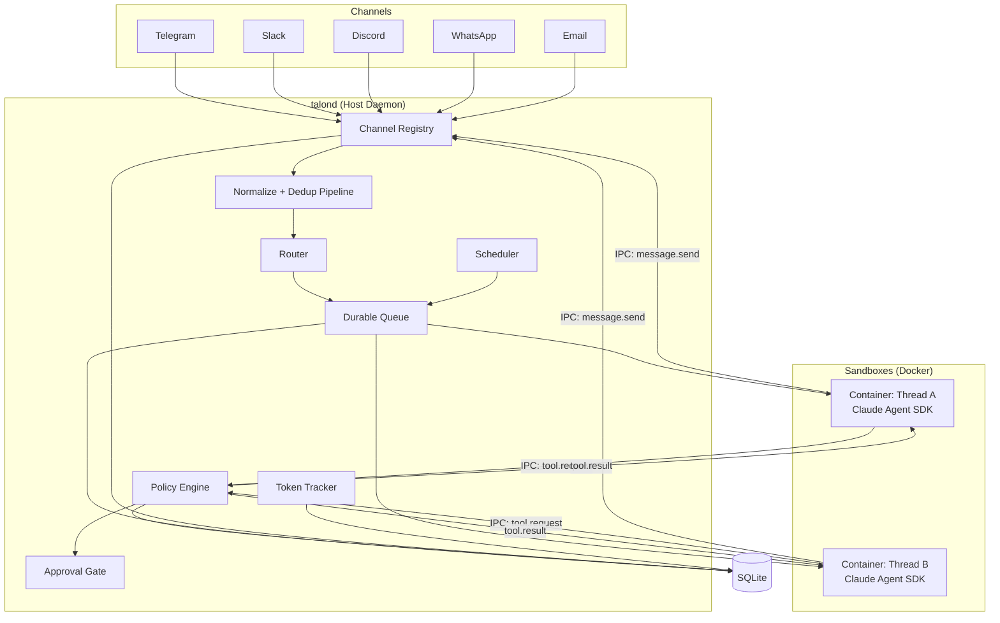
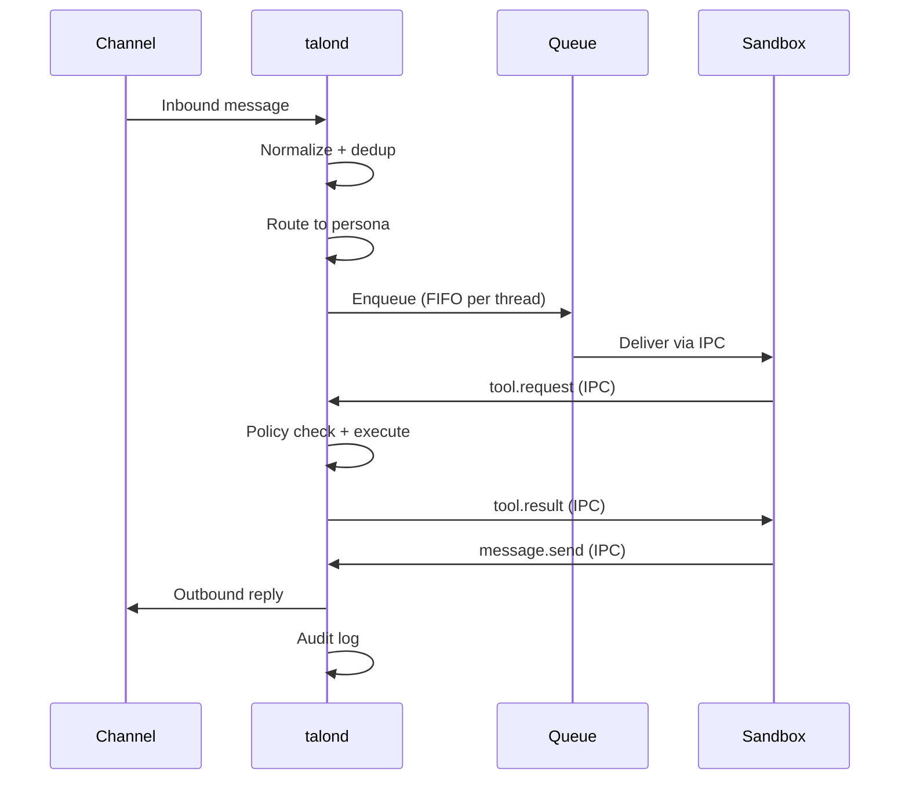
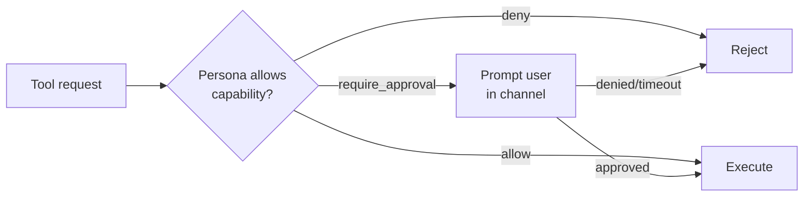
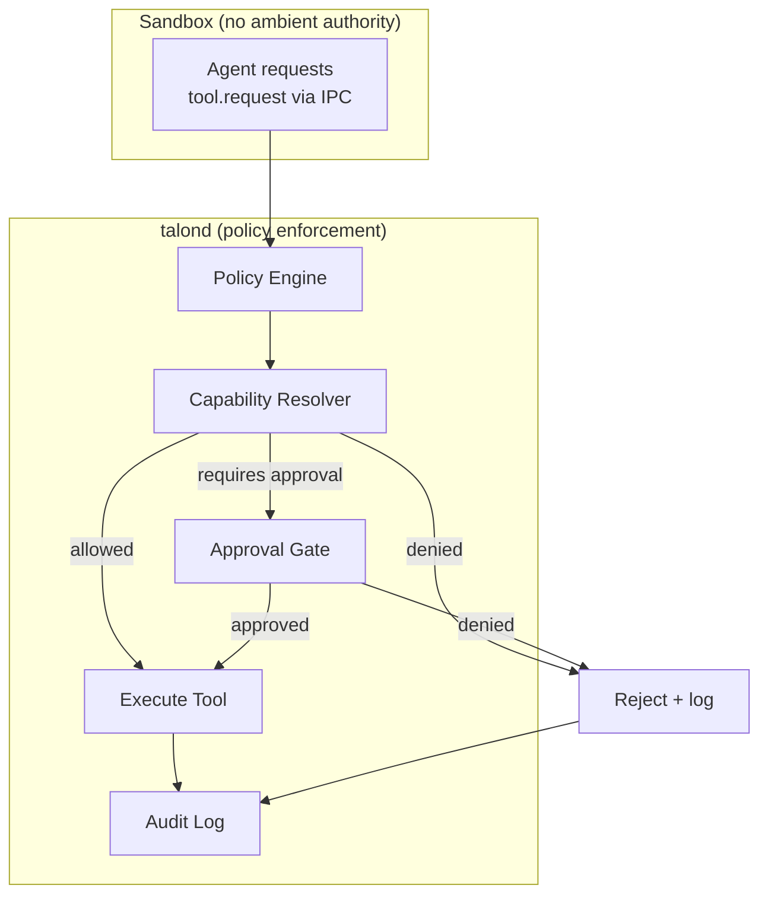
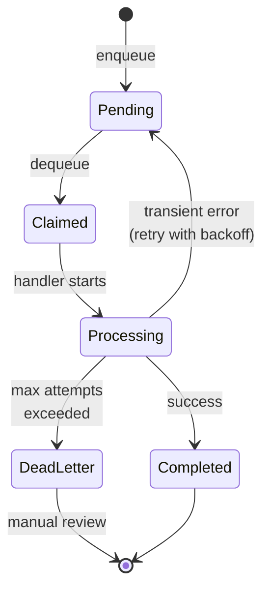
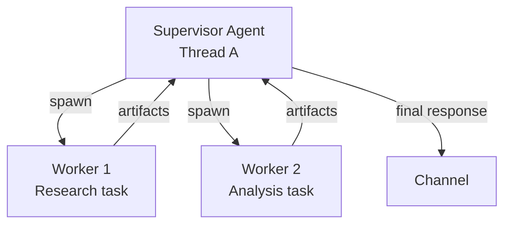

# Talon

**Resilient, secure, extensible autonomous agent daemon.**

[](#testing)
[](https://nodejs.org)
[](LICENSE)
[](https://www.typescriptlang.org)

---

## What is Talon?

Talon is a self-hosted daemon that orchestrates autonomous AI agents across multiple communication channels. You configure personas — each with their own system prompt, tools, and security policy — and bind them to channels like Telegram, Slack, Discord, WhatsApp, or email. Messages flow in, get routed to the right persona, processed inside isolated container sandboxes, and responses flow back out.

It is built for single-user or small-team deployments where you want persistent, always-on AI agents that you fully control — no cloud platform, no vendor lock-in, just a daemon on your server.

### Why Talon?

- **Self-hosted**: runs on your own hardware, your data stays with you
- **Resilient**: durable message queue survives crashes, automatic retry with exponential backoff, dead-letter handling
- **Secure**: agents run inside sandboxed containers with no ambient authority — every capability is explicitly granted
- **Multi-channel**: one daemon handles Telegram, Slack, Discord, WhatsApp, and email simultaneously
- **Multi-persona**: different agents with different personalities, tools, and permissions on different channels

---

## Features

### Channels

- **Telegram** — Long polling with MarkdownV2 formatting
- **Slack** — Events API / Socket Mode with mrkdwn formatting
- **Discord** — Gateway events with REST API, rate limit handling
- **WhatsApp** — Cloud API with webhook inbound
- **Email** — IMAP polling + SMTP send, thread tracking via In-Reply-To headers

### Agent System

- **Persona-per-channel** — Each channel gets its own agent with a dedicated system prompt, model, tools, and capabilities
- **Container sandboxing** — Agents execute inside Docker containers with `--cap-drop=ALL`, read-only rootfs, no network by default
- **Per-thread memory** — Each conversation thread gets its own workspace with transcript, working memory, and artifacts
- **Skills** — Modular prompt fragments and tool bundles that snap onto personas
- **MCP integration** — Connect external MCP tool servers, host-brokered with policy enforcement

### Infrastructure

- **Durable queue** — SQLite-backed message queue with crash recovery, retry, and dead-letter
- **Scheduler** — Cron, interval, and one-shot scheduled tasks
- **File-based IPC** — Atomic write + poll protocol between host and sandboxes
- **Hot reload** — Change config, personas, and skills without restarting the daemon
- **Systemd integration** — Watchdog heartbeat, graceful shutdown, timer-based wake-only mode
- **Token tracking** — Per-persona and per-thread usage aggregation with budget limits

### Security

- **Default-deny capabilities** — Tools are gated by capability labels, not raw names
- **Approval gates** — High-risk actions prompt for user approval in-channel before executing
- **Secrets management** — Secrets delivered to containers via stdin JSON, never written to disk
- **Audit logging** — Every side-effecting operation recorded with full provenance

---

## Architecture

Talon follows a **host-mediated security model**: agents run inside sandboxed containers and request actions through IPC. The host daemon enforces all policy, mediates all side effects, and owns all persistence.



### Message Flow



---

## Quick Start

### Prerequisites

- **Node.js 22+**
- **Docker** (for container sandboxing)
- **SQLite** (ships with better-sqlite3, no separate install)

### Install

```bash
git clone https://github.com/your-org/talon.git
cd talon
npm install
npm run build
```

### First-Time Setup

```bash
# Run interactive setup — checks environment, creates directories, generates config
npx talonctl setup

# Add a Telegram channel
npx talonctl add-channel --name my-telegram --type telegram

# Add a persona
npx talonctl add-persona --name assistant

# Run database migrations
npx talonctl migrate

# Check everything is ready
npx talonctl doctor
```

### Start the Daemon

```bash
# Direct
node dist/index.js --config talond.yaml

# Or via npm
npm run talond
```

---

## Configuration

Talon uses a single YAML configuration file. A fully annotated example ships at [`config/talond.example.yaml`](config/talond.example.yaml).

### Minimal Configuration

```yaml
storage:
  type: sqlite
  path: data/talond.sqlite

sandbox:
  runtime: docker
  image: talon-sandbox:latest
  maxConcurrent: 3
  networkDefault: off
  idleTimeoutMs: 1800000
  hardTimeoutMs: 3600000
  resourceLimits:
    memoryMb: 1024
    cpus: 1
    pidsLimit: 256

queue:
  maxAttempts: 3
  backoffBaseMs: 1000
  backoffMaxMs: 60000
  concurrencyLimit: 5

personas:
  - name: assistant
    model: claude-sonnet-4-6
    systemPromptFile: personas/assistant/system.md
    skills: []
    capabilities:
      allow:
        - channel.send:telegram
      requireApproval: []
    mounts: []

channels:
  - name: my-telegram
    type: telegram
    enabled: true
    config:
      token: ${TELEGRAM_BOT_TOKEN}

schedules: []

ipc:
  pollIntervalMs: 500
  daemonSocketDir: data/ipc/daemon

scheduler:
  tickIntervalMs: 5000

auth:
  mode: subscription

logLevel: info
dataDir: data
```

### Configuration Sections

| Section                | Purpose                                                                       |
| ---------------------- | ----------------------------------------------------------------------------- |
| `storage`              | Database backend and SQLite path                                              |
| `sandbox`              | Container runtime, image, limits, and network defaults                        |
| `queue`                | Retry/backoff/concurrency controls for durable queue processing               |
| `personas`             | Persona profiles: model, system prompt, skills, capabilities, mounts          |
| `channels`             | Channel connector entries with `type`, `name`, and connector `config` payload |
| `schedules`            | Declarative schedule entries (`cron`, `interval`, `one_shot`, `event`)        |
| `ipc`                  | IPC polling settings and daemon IPC directory                                 |
| `scheduler`            | Scheduler tick interval                                                       |
| `auth`                 | `subscription` or `api_key` authentication mode                               |
| `logLevel` / `dataDir` | Runtime logging level and data root                                           |

### Environment Variable Substitution

Credential fields support `${ENV_VAR}` syntax so you never hardcode secrets:

```yaml
channels:
  - name: my-telegram
    type: telegram
    token: ${TELEGRAM_BOT_TOKEN}
```

---

## Channel Connectors

Each connector implements the `ChannelConnector` interface: `start()`, `stop()`, `onMessage()`, `send()`, and `format()`. All connectors convert Markdown output to channel-native formatting automatically.

### Telegram

Long-polling connector using the Telegram Bot API.

```yaml
channels:
  - name: my-telegram
    type: telegram
    token: ${TELEGRAM_BOT_TOKEN}
    allowed_user_ids:
      - 123456789
    polling: true
```

- **Inbound**: Long polling via `getUpdates`
- **Outbound**: `sendMessage` with MarkdownV2 parse mode
- **Idempotency key**: `update_id`
- **Thread mapping**: `chat_id`

### Slack

Event-driven connector for Slack's Events API or Socket Mode.

```yaml
channels:
  - name: my-slack
    type: slack
    bot_token: ${SLACK_BOT_TOKEN}
    app_token: ${SLACK_APP_TOKEN}
    signing_secret: ${SLACK_SIGNING_SECRET}
```

- **Inbound**: Events API webhooks or Socket Mode
- **Outbound**: `chat.postMessage` Web API
- **Idempotency key**: `event_id` > `client_msg_id` > `channel:ts`
- **Thread mapping**: `channel_id:thread_ts`
- **Format**: Slack mrkdwn (`*bold*`, `_italic_`, `` `code` ``)

### Discord

Push-based connector using the Discord Gateway and REST API.

```yaml
channels:
  - name: my-discord
    type: discord
    token: ${DISCORD_BOT_TOKEN}
    application_id: '123456789'
    allowed_channel_ids:
      - '987654321'
```

- **Inbound**: Gateway `MESSAGE_CREATE` events
- **Outbound**: REST API `POST /channels/{id}/messages`
- **Idempotency key**: Message snowflake ID
- **Thread mapping**: `channel_id:message_id`
- **Rate limiting**: Automatic retry with `Retry-After` header handling

### WhatsApp

Webhook-based connector using the WhatsApp Cloud API.

```yaml
channels:
  - name: my-whatsapp
    type: whatsapp
    phone_number_id: '123456789'
    access_token: ${WHATSAPP_ACCESS_TOKEN}
    verify_token: ${WHATSAPP_VERIFY_TOKEN}
    webhook_path: /webhook/whatsapp
```

- **Inbound**: Webhook events via `feedWebhook()`
- **Outbound**: Cloud API `POST /{phone_number_id}/messages`
- **Idempotency key**: `message_id`
- **Format**: WhatsApp-flavored markdown

### Email

Dual-mode connector with IMAP polling and SMTP outbound.

```yaml
channels:
  - name: my-email
    type: email
    imap:
      host: mail.example.com
      port: 993
      user: agent@example.com
      password: ${EMAIL_PASSWORD}
    smtp:
      host: mail.example.com
      port: 587
      user: agent@example.com
      password: ${EMAIL_PASSWORD}
    from_address: agent@example.com
    allowed_senders:
      - you@example.com
    polling_interval_ms: 30000
```

- **Inbound**: IMAP polling (or webhook via `feedInbound()`)
- **Outbound**: SMTP with HTML formatting
- **Idempotency key**: `Message-ID` header
- **Thread mapping**: `In-Reply-To` / `References` headers
- **Format**: Markdown to HTML conversion

---

## Personas

A persona defines an AI agent's identity, capabilities, and channel bindings.

```yaml
personas:
  - name: alfred
    description: Personal assistant
    model: claude-sonnet-4-6
    system_prompt: |
      You are Alfred, a meticulous personal assistant.
      Be concise. Use Markdown for formatting.

    channels:
      - my-telegram
      - my-slack

    skills:
      - web-search
      - calendar

    capabilities:
      web_fetch: allow
      fs_read: deny
      fs_write: deny
      shell: deny
      send_channel: allow

    memory:
      context_window_messages: 20
      long_term: false

    network:
      enabled: false
```

### Capability Labels

Tools are gated by capability labels, not raw tool names. This allows fine-grained control:

| Capability        | Description               |
| ----------------- | ------------------------- |
| `web_fetch`       | Fetch public URLs         |
| `fs_read`         | Read host filesystem      |
| `fs_write`        | Write host filesystem     |
| `shell`           | Execute shell commands    |
| `send_channel`    | Send messages to channels |
| `db_query`        | Execute database queries  |
| `schedule_manage` | Create/modify schedules   |
| `memory_access`   | Read/write thread memory  |

Each capability can be set to `allow`, `deny`, or `require_approval`.

### Capability Resolution

When an agent requests a tool:



---

## Skills

Skills are modular bundles of prompts, tools, and configuration that snap onto personas.

### Skill Structure

```
skills/<skill_name>/
  skill.yaml          # metadata, required capabilities, config schema
  prompts/*.md        # persona augmentation fragments
  tools/*.yaml        # tool manifests (capability labels + schemas)
  mcp/*.json          # MCP server definitions (optional)
  migrations/*.sql    # DB migrations (optional)
```

### Adding a Skill

```bash
# Scaffold a new skill and attach it to a persona
npx talonctl add-skill --name web-search --persona assistant
```

This creates the skill directory structure, generates a default `skill.yaml`, and adds the skill to the persona in `talond.yaml`.

### Skill Resolution

Persona capabilities and skill requirements are intersected at runtime:

```
granted = persona.capabilities ∩ skill.requiredCapabilities
```

Skills with unmet capabilities produce a warning at startup and are skipped.

---

## CLI Reference

`talonctl` is the management CLI for the daemon. All commands are available via `npx talonctl <command>`.

### Daemon Management

| Command           | Description                                                   |
| ----------------- | ------------------------------------------------------------- |
| `talonctl status` | Show daemon health, active channels, queue depth, token usage |
| `talonctl reload` | Hot-reload config without restarting the daemon               |

```bash
# Check daemon status
npx talonctl status --timeout 5000

# Reload configuration
npx talonctl reload
```

### Setup and Configuration

| Command                                       | Description                                                                       |
| --------------------------------------------- | --------------------------------------------------------------------------------- |
| `talonctl setup`                              | First-time interactive setup (checks environment, creates dirs, generates config) |
| `talonctl add-channel --name <n> --type <t>`  | Add a channel connector to config                                                 |
| `talonctl add-persona --name <n>`             | Scaffold a persona directory and add to config                                    |
| `talonctl add-skill --name <n> --persona <p>` | Scaffold a skill and attach to a persona                                          |

```bash
# Full setup flow
npx talonctl setup --config talond.yaml --data-dir data
npx talonctl add-channel --name work-slack --type slack
npx talonctl add-persona --name researcher
npx talonctl add-skill --name web-search --persona researcher
```

### Database and Operations

| Command            | Description                                                    |
| ------------------ | -------------------------------------------------------------- |
| `talonctl migrate` | Apply pending database migrations                              |
| `talonctl backup`  | Snapshot SQLite database and data directory                    |
| `talonctl doctor`  | Run diagnostic checks on environment, config, and dependencies |

```bash
# Run migrations
npx talonctl migrate --config talond.yaml

# Create a backup
npx talonctl backup --config talond.yaml --output /backups/talon-$(date +%Y%m%d).tar.gz

# Check system health
npx talonctl doctor --config talond.yaml
```

### Doctor Checks

`talonctl doctor` runs 7 structured checks:

1. **OS compatibility** — Verifies Linux or macOS
2. **Node.js version** — Checks for Node 22+
3. **Docker availability** — Verifies Docker is installed and running
4. **Directory structure** — Ensures data directories exist
5. **Config file** — Validates `talond.yaml` syntax and schema
6. **Database migrations** — Checks for pending migrations
7. **Config validation** — Deep validation of personas, channels, and references

---

## Deployment

Talon supports three deployment modes.

### 1. Native Daemon (systemd)

The recommended mode for Linux servers. The daemon runs as a systemd service, sandboxes are spawned via local Docker.

```bash
# Copy the service file
sudo cp deploy/talond.service /etc/systemd/system/

# Enable and start
sudo systemctl daemon-reload
sudo systemctl enable talond
sudo systemctl start talond

# Check status
sudo systemctl status talond
journalctl -u talond -f
```

The service includes comprehensive security hardening: `NoNewPrivileges`, `ProtectSystem=strict`, `PrivateTmp`, `ProtectKernelTunables`, `CapabilityBoundingSet=`, and `SystemCallFilter`.

### 2. Containerized Daemon (Docker)

Run the daemon itself inside Docker. Uses Docker-in-Docker or sibling containers for sandboxing.

```bash
# Build the images
docker build -t talond:latest -f deploy/Dockerfile .
docker build -t talon-sandbox:latest -f deploy/Dockerfile.sandbox .

# Run with Docker Compose
docker compose -f deploy/docker-compose.yaml up -d
```

Or manually:

```bash
docker run -d \
  --name talond \
  -v talon-data:/data \
  -v ./talond.yaml:/config/talond.yaml:ro \
  --env-file .env \
  --restart unless-stopped \
  talond:latest
```

### 3. Wake-Only Mode (Timer)

For low-traffic deployments. A systemd timer wakes the daemon periodically to process the queue, then exits.

```bash
sudo cp deploy/talond-wake.service /etc/systemd/system/
sudo cp deploy/talond.timer /etc/systemd/system/

sudo systemctl daemon-reload
sudo systemctl enable talond.timer
sudo systemctl start talond.timer
```

Default: wakes every 5 minutes. Adjust `OnUnitActiveSec` in `talond.timer`.

### Deployment Files

| File                                                       | Purpose                                           |
| ---------------------------------------------------------- | ------------------------------------------------- |
| [`deploy/Dockerfile`](deploy/Dockerfile)                   | Multi-stage talond container image (node:22-slim) |
| [`deploy/Dockerfile.sandbox`](deploy/Dockerfile.sandbox)   | Agent sandbox image with SDK runtime              |
| [`deploy/docker-compose.yaml`](deploy/docker-compose.yaml) | Example Compose setup                             |
| [`deploy/talond.service`](deploy/talond.service)           | systemd service unit (native daemon)              |
| [`deploy/talond.timer`](deploy/talond.timer)               | systemd timer (wake-only mode)                    |
| [`deploy/talond-wake.service`](deploy/talond-wake.service) | systemd oneshot for timer-triggered wake          |

---

## Security Model

Talon implements defense in depth through container isolation, capability-based access control, and host-mediated side effects.

### Container Sandboxing

Every agent runs inside a Docker container with hardened defaults:

- `--cap-drop=ALL` — No Linux capabilities
- `--read-only` rootfs with tmpfs for `/tmp`
- No Docker socket access
- No network by default (enable per-persona with domain allowlists)
- Resource limits: CPU, memory, PIDs
- Strict mount allowlist: only thread-scoped directories

### Capability System



Agents have no ambient authority. Every tool call goes through:

1. **Policy Engine** — Validates the tool exists and is enabled for this persona
2. **Capability Resolver** — Checks the persona grants the required capability label
3. **Approval Gate** — For `require_approval` capabilities, prompts the user in-channel
4. **Audit Log** — Records the decision and result regardless of outcome

### Secrets Management

- Secrets live on the host (environment variables, OS keychain, secret store)
- Delivered to containers via stdin JSON at spawn time
- Never written to disk inside containers
- Host tools that need secrets execute on the host side, not in the sandbox

### Approval Gates

High-risk capabilities can require interactive user approval:

```yaml
capabilities:
  fs_write: require_approval # prompts "Allow write to /workspace? [y/n]"
  shell: deny # never allowed
  send_channel: allow # no prompt needed
```

Approval prompts are sent to the originating channel with a configurable timeout.

---

## Durable Queue

The message queue is the backbone of Talon's resilience. Every inbound message is persisted to SQLite before processing begins.



- **Crash recovery**: On restart, in-flight items (status `claimed` or `processing`) are reset to `pending`
- **FIFO per thread**: Messages within a thread are processed in order, no interleaving
- **Cross-thread parallelism**: Different threads process concurrently up to `max_concurrent_containers`
- **Exponential backoff**: Failed items retry with configurable base delay (1s), max delay (60s), and jitter
- **Dead-letter queue**: After max attempts (default 5), items move to dead-letter for manual review

---

## Memory System

Each conversation thread gets a persistent workspace:

```
data/threads/<thread_id>/
  memory/          # human-editable notes (CLAUDE.md, etc.)
  attachments/     # ingested inbound files
  artifacts/       # agent output files
  ipc/
    input/         # host -> container messages
    output/        # container -> host messages
    errors/        # failed IPC messages
```

### Memory Layers

| Layer             | Storage                | Purpose                                         |
| ----------------- | ---------------------- | ----------------------------------------------- |
| Transcript        | `messages` table       | Canonical message log, never rewritten          |
| Working memory    | In-prompt context      | Recent message window included in agent prompts |
| Thread notebook   | Filesystem (`memory/`) | Human-editable per-thread notes                 |
| Structured memory | `memory_items` table   | Extracted facts and summaries                   |

Memory writes are gated by persona capabilities. Thread notebooks persist across container restarts.

---

## Scheduling

The scheduler supports recurring and one-shot tasks that flow through the same queue and routing system as regular messages.

```yaml
scheduler:
  timezone: UTC
  tasks:
    - name: daily-summary
      cron: '0 8 * * *'
      persona: assistant
      prompt: 'Generate a daily briefing.'
      channels:
        - my-telegram

    - name: hourly-check
      interval: 60m
      persona: monitor
      prompt: 'Check system health.'
```

| Schedule Type | Example                | Behavior                           |
| ------------- | ---------------------- | ---------------------------------- |
| Cron          | `0 9 * * *`            | Fires at 09:00 daily               |
| Interval      | `every 30m`            | Recurring at fixed intervals       |
| One-shot      | `at 2026-03-01T10:00Z` | Single execution at specified time |

Scheduled tasks are enqueued through the standard queue pipeline, subject to the same retry and dead-letter policies as regular messages.

---

## MCP Integration

Talon supports the [Model Context Protocol](https://modelcontextprotocol.io) for connecting external tool servers.

```yaml
mcp:
  clients:
    - name: filesystem-mcp
      url: http://localhost:5174
      personas:
        - assistant

  server:
    enabled: false
    # host: 127.0.0.1
    # port: 5173
```

MCP tool calls are policy-checked identically to host tools — the sandbox requests an MCP call via IPC, the host validates against the persona's capability policy, and forwards it if allowed. Each MCP server has its own credential scope and can be scoped to specific personas.

---

## Token Usage Tracking

When using Anthropic API keys, Talon tracks token usage per run:

- Input tokens, output tokens, cache read/write tokens
- Aggregated per persona, per thread, per time period
- Optional budget limits with soft warnings and hard caps

```yaml
personas:
  - name: assistant
    budget:
      daily_limit: 100000 # tokens
      warning_threshold: 0.8 # warn at 80% usage
```

View current usage via `talonctl status`, which shows 24-hour token consumption per persona.

---

## Development

### Build

```bash
npm install
npm run build          # TypeScript -> dist/
```

### Test

```bash
npm test               # Run all 2211 tests
npm run test:watch     # Watch mode
npm run test:coverage  # Coverage report (80% target)
```

The test suite includes:

- **Unit tests** — Every module, repository, connector, and CLI command
- **Integration tests** — IPC round-trips, queue durability, channel registry lifecycle
- **End-to-end tests** — Full message flow from inbound to outbound with real SQLite

### Lint and Format

```bash
npm run lint           # ESLint with TypeScript strict rules
npm run format         # Prettier
```

### Dev Server

```bash
npm run dev            # tsx watch mode with auto-reload
```

---

## Project Structure

```
talon/
  config/
    talond.example.yaml          # Annotated example configuration
  deploy/
    Dockerfile                   # talond container image
    Dockerfile.sandbox           # Agent sandbox image
    docker-compose.yaml          # Example Compose setup
    talond.service               # systemd service unit
    talond.timer                 # systemd timer (wake-only)
    talond-wake.service          # Oneshot service for timer wake
  src/
    channels/
      connectors/
        telegram/                # Telegram Bot API connector
        slack/                   # Slack Events API connector
        discord/                 # Discord Gateway + REST connector
        whatsapp/                # WhatsApp Cloud API connector
        email/                   # IMAP + SMTP connector
      channel-registry.ts        # Connector lifecycle management
      channel-router.ts          # Thread -> persona routing
      channel-types.ts           # ChannelConnector interface
    cli/
      commands/                  # talonctl subcommands
      index.ts                   # CLI entry point (commander)
    collaboration/
      supervisor.ts              # Multi-agent supervisor
      worker-manager.ts          # Worker sandbox orchestration
    core/
      config/                    # YAML loader + Zod schemas
      database/
        migrations/              # Versioned SQL migrations
        repositories/            # Repository pattern (12 repos)
        connection.ts            # SQLite connection factory
      errors/                    # TalonError hierarchy (16 error types)
      logging/                   # pino logger + audit logger
      types/                     # Result helpers, common types
    daemon/
      daemon.ts                  # TalondDaemon orchestrator
      lifecycle.ts               # PID file, crash recovery
      signal-handler.ts          # SIGTERM/SIGINT handling
      watchdog.ts                # systemd watchdog heartbeat
    ipc/
      ipc-writer.ts              # Atomic file write
      ipc-reader.ts              # Directory poll + validate
      ipc-channel.ts             # Bidirectional IPC channel
      daemon-ipc-server.ts       # talond <-> talonctl IPC
    mcp/
      mcp-proxy.ts               # MCP tool proxy
      mcp-registry.ts            # MCP server registry
    memory/
      memory-manager.ts          # Memory read/write/delete
      thread-workspace.ts        # Per-thread filesystem layout
      context-builder.ts         # Prompt context assembly
    personas/
      persona-loader.ts          # Load + validate personas
      capability-merger.ts       # Persona x skill capability resolution
    pipeline/
      message-normalizer.ts      # Inbound message normalization
      message-pipeline.ts        # Normalize -> dedup -> route -> enqueue
    queue/
      queue-manager.ts           # Queue lifecycle + processing loop
      queue-processor.ts         # Item processing with retry
      retry-strategy.ts          # Exponential backoff with jitter
      dead-letter.ts             # Dead-letter queue management
    sandbox/
      sandbox-manager.ts         # Container lifecycle management
      container-factory.ts       # Docker container creation
      sdk-process-spawner.ts     # Claude Agent SDK process runner
      session-tracker.ts         # Warm container session tracking
    scheduler/
      scheduler.ts               # Tick-based schedule processor
      cron-evaluator.ts          # Cron expression evaluation
    skills/
      skill-loader.ts            # Load + validate skills
      skill-resolver.ts          # Skill -> persona resolution
    tools/
      host-tools/                # Host-side tool handlers
        channel-send.ts          # Send via channel connector
        http-proxy.ts            # Fetch with domain allowlist
        memory-access.ts         # Thread memory CRUD
        schedule-manage.ts       # Schedule CRUD
        db-query.ts              # Read-only DB queries
      tool-registry.ts           # Tool manifest registry
      policy-engine.ts           # Capability-based access control
      capability-resolver.ts     # Label resolution
      approval-gate.ts           # In-channel approval prompting
    usage/
      token-tracker.ts           # Token usage recording + aggregation
  tests/
    unit/                        # Unit tests (mirrors src/ structure)
    integration/                 # Integration + e2e tests
```

---

## Data Model

Talon uses SQLite with WAL mode and foreign keys. All persistence goes through the repository pattern for future Postgres portability.

### Tables

| Table          | Purpose                                                         |
| -------------- | --------------------------------------------------------------- |
| `channels`     | Channel connector configurations                                |
| `personas`     | Agent profiles and capabilities                                 |
| `bindings`     | Channel+thread to persona routing                               |
| `threads`      | Conversation thread metadata                                    |
| `messages`     | Normalized inbound/outbound messages                            |
| `queue_items`  | Durable work queue with retry state                             |
| `runs`         | Agent execution records (supports parent/child for multi-agent) |
| `schedules`    | Cron/interval/one-shot job definitions                          |
| `memory_items` | Structured per-thread memory                                    |
| `artifacts`    | Agent output files                                              |
| `audit_log`    | Append-only audit trail                                         |
| `tool_results` | Idempotent tool result cache                                    |

---

## Multi-Agent Collaboration

Talon supports supervisor/worker patterns where a primary agent spawns sub-agents for parallel work.



- Workers run in separate sandboxes with their own tool scope
- Child runs tracked via `parent_run_id` in the `runs` table
- Workers cannot send channel messages unless explicitly allowed
- Supervisor reads worker outputs as artifacts

---

## Contributing

1. Fork the repository
2. Create a feature branch (`git checkout -b feature/my-feature`)
3. Write tests first — the project maintains 80%+ coverage
4. Run the full test suite (`npm test`)
5. Run the type checker (`npx tsc --noEmit`)
6. Run the linter (`npm run lint`)
7. Submit a pull request

### Code Conventions

- **Files**: kebab-case (`sandbox-manager.ts`)
- **Functions**: camelCase (`loadConfig()`)
- **Types/Classes**: PascalCase (`TalondDaemon`)
- **Constants**: UPPER_SNAKE_CASE (`MAX_BACKOFF_MS`)
- **Error handling**: `neverthrow` Result types for expected errors, exceptions for truly unrecoverable failures
- **Logging**: `pino` structured JSON with correlation fields (`run_id`, `thread_id`, `persona`)
- **Imports**: ESM with `.js` extensions, `type` imports where possible
- **Testing**: Vitest, aim for 80%+ coverage, mock external services only

---

## License

[MIT](LICENSE)
