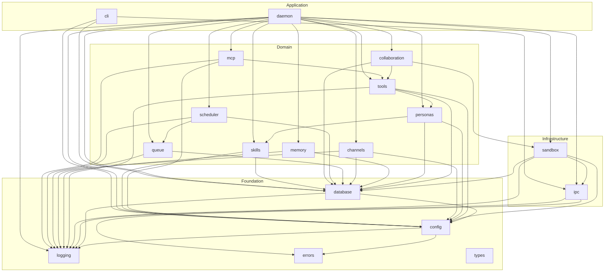

# Talon v1 — Technical Implementation Plan

> Date: 2026-02-26
> Status: Complete
> Author: Architect Agent
> References: `specs/talon-v1/spec.md`, `.claudecraft/constitution.md`, `AUTONOMOUS_AGENT_DESIGN.md`, `specs/talon-v1/research.md`

---

## 1. Architecture Overview

### 1.1 High-Level Component Diagram

```
                    talonctl (CLI)
                         |
                    file-based IPC
                         |
    +-----------------------------------------+
    |              talond (daemon)             |
    |                                         |
    |  +----------+  +-----------+  +-------+ |
    |  | config   |  | channel   |  | queue | |
    |  | system   |  | system    |  | system| |
    |  +----------+  +-----------+  +-------+ |
    |                                         |
    |  +----------+  +-----------+  +-------+ |
    |  | router   |  | scheduler |  | audit | |
    |  +----------+  +-----------+  +-------+ |
    |                                         |
    |  +----------+  +-----------+  +-------+ |
    |  | sandbox  |  | tool      |  |memory | |
    |  | manager  |  | system    |  |system | |
    |  +----------+  +-----------+  +-------+ |
    |       |                                 |
    +-------|------ ---------------------------+
            |
            | Docker API (dockerode)
            v
    +-------------------+  +-------------------+
    | Container (t-001) |  | Container (t-002) |
    | Claude Code CLI   |  | Claude Code CLI   |
    | Agent SDK runtime |  | Agent SDK runtime |
    +-------------------+  +-------------------+
```

### 1.2 Module Structure

```
src/
  index.ts                          # talond entry point
  cli/
    index.ts                        # talonctl entry point
    commands/                       # CLI command modules
      status.ts
      setup.ts
      doctor.ts
      add-channel.ts
      add-persona.ts
      add-skill.ts
      migrate.ts
      backup.ts
      reload.ts
  core/
    config/
      config-loader.ts              # YAML loading + Zod validation
      config-schema.ts              # Zod schemas + inferred types
      config-types.ts               # Exported config types
    database/
      connection.ts                 # SQLite connection factory
      migrations/
        runner.ts                   # Migration runner
        001-initial-schema.sql      # Base schema
      repositories/
        channel-repository.ts
        persona-repository.ts
        binding-repository.ts
        thread-repository.ts
        message-repository.ts
        queue-repository.ts
        run-repository.ts
        schedule-repository.ts
        memory-repository.ts
        artifact-repository.ts
        audit-repository.ts
        tool-result-repository.ts
    logging/
      logger.ts                     # pino setup + child logger factory
      audit-logger.ts               # Audit log writer (DB + pino)
    errors/
      error-types.ts                # Domain error definitions
      error-codes.ts                # Error code constants
    types/
      common.ts                     # Shared types (UUID, Timestamp, etc.)
      result.ts                     # Re-exports from neverthrow + helpers
  ipc/
    ipc-types.ts                    # IPC message type definitions + Zod schemas
    ipc-writer.ts                   # Atomic file writer
    ipc-reader.ts                   # Directory poller/reader
    ipc-channel.ts                  # Bidirectional IPC channel abstraction
    daemon-ipc.ts                   # talond <-> talonctl IPC handler
  sandbox/
    sandbox-manager.ts              # Container lifecycle management
    sandbox-types.ts                # Container state, config types
    container-factory.ts            # Docker container creation
    container-health.ts             # Health monitoring
    sdk-process-spawner.ts          # spawnClaudeCodeProcess implementation
    session-tracker.ts              # SDK session ID tracking per thread
  tools/
    tool-registry.ts                # Tool registration and lookup
    tool-types.ts                   # Tool manifest types
    capability-resolver.ts          # Capability intersection logic
    policy-engine.ts                # Policy evaluation (allow/deny/approve)
    approval-gate.ts                # In-channel approval prompting
    host-tools/                     # Built-in host-side tools
      channel-send.ts
      schedule-manage.ts
      memory-access.ts
      http-proxy.ts
      db-query.ts
  personas/
    persona-loader.ts               # Load persona configs
    persona-types.ts                # Persona type definitions
    capability-types.ts             # Capability label types + validation
  memory/
    memory-manager.ts               # Layered memory orchestration
    memory-types.ts                 # Memory item types
    context-builder.ts              # Build context for agent prompts
    thread-workspace.ts             # Thread directory management
  channels/
    channel-types.ts                # ChannelConnector interface + types
    channel-registry.ts             # Connector registry
    channel-router.ts               # Thread -> persona routing
    format/
      markdown-converter.ts         # Base markdown utilities
    connectors/
      telegram/
        telegram-connector.ts
        telegram-format.ts
        telegram-types.ts
      whatsapp/
        whatsapp-connector.ts
        whatsapp-format.ts
        whatsapp-types.ts
      slack/
        slack-connector.ts
        slack-format.ts
        slack-types.ts
      email/
        email-connector.ts
        email-format.ts
        email-types.ts
      discord/
        discord-connector.ts
        discord-format.ts
        discord-types.ts
  queue/
    queue-manager.ts                # Durable queue orchestration
    queue-types.ts                  # Queue item types + states
    queue-processor.ts              # Dequeue + dispatch to sandbox
    retry-strategy.ts               # Exponential backoff with jitter
    dead-letter.ts                  # Dead-letter handling
  scheduler/
    scheduler.ts                    # Tick-based scheduler
    schedule-types.ts               # Schedule type definitions
    cron-evaluator.ts               # Cron expression evaluation
  collaboration/
    supervisor.ts                   # Multi-agent supervisor logic
    worker-manager.ts               # Child run management
    collaboration-types.ts          # Collaboration type definitions
  mcp/
    mcp-proxy.ts                    # MCP tool proxy (host-brokered)
    mcp-types.ts                    # MCP config types
    mcp-registry.ts                 # MCP server registry
  skills/
    skill-loader.ts                 # Skill directory parsing
    skill-types.ts                  # Skill manifest types
    skill-resolver.ts               # Skill capability resolution
  daemon/
    daemon.ts                       # Main daemon lifecycle
    lifecycle.ts                    # Start/stop/reload orchestration
    signal-handler.ts               # SIGTERM, SIGINT, SIGHUP handling
    health-check.ts                 # Health status for systemd watchdog

tests/
  unit/                             # Mirror of src/ structure
  integration/
    sandbox.test.ts                 # Docker container spawn/kill
    ipc.test.ts                     # File-based IPC round-trip
    queue.test.ts                   # Queue durability + retry
    e2e/
      message-flow.test.ts          # Full message -> reply flow

data/                               # Runtime data directory (gitignored)
  talond.sqlite
  threads/

config/
  talond.example.yaml               # Example config
  personas/                         # Persona prompt files
    alfred/
      system.md

skills/                             # Skill packages
  gmail/
  web/

deploy/
  Dockerfile                        # talond container image
  Dockerfile.sandbox                # Agent sandbox container image
  talond.service                    # systemd unit
  talond.timer                      # systemd timer (wake-only mode)
```

### 1.3 Dependency Graph Between Modules



---

## 2. Data Layer

### 2.1 SQLite Schema

All tables use `TEXT` for UUIDs (stored as lowercase hex with hyphens), `INTEGER` for timestamps (Unix epoch milliseconds), and `TEXT` for JSON blobs.

```sql
-- Migration 001: Initial Schema
-- Applied via: talonctl migrate

PRAGMA journal_mode = WAL;
PRAGMA foreign_keys = ON;
PRAGMA busy_timeout = 5000;

-- ============================================================
-- CHANNELS
-- ============================================================
CREATE TABLE channels (
  id          TEXT PRIMARY KEY,
  type        TEXT NOT NULL,                    -- 'telegram', 'whatsapp', 'slack', 'email', 'discord'
  name        TEXT NOT NULL UNIQUE,
  config      TEXT NOT NULL DEFAULT '{}',       -- JSON: channel-specific config
  credentials_ref TEXT,                         -- reference to secret (e.g., 'secrets:telegram_bot_token')
  enabled     INTEGER NOT NULL DEFAULT 1,       -- boolean: 0 or 1
  created_at  INTEGER NOT NULL,
  updated_at  INTEGER NOT NULL
);

CREATE INDEX idx_channels_type ON channels(type);
CREATE INDEX idx_channels_enabled ON channels(enabled);

-- ============================================================
-- PERSONAS
-- ============================================================
CREATE TABLE personas (
  id                  TEXT PRIMARY KEY,
  name                TEXT NOT NULL UNIQUE,
  model               TEXT NOT NULL DEFAULT 'claude-sonnet-4-6',
  system_prompt_file  TEXT,                     -- relative path to system prompt markdown
  skills              TEXT NOT NULL DEFAULT '[]',  -- JSON array of skill names
  capabilities        TEXT NOT NULL DEFAULT '{}',  -- JSON: { allow: [...], requireApproval: [...] }
  mounts              TEXT NOT NULL DEFAULT '[]',  -- JSON array of mount configs
  max_concurrent      INTEGER,                  -- per-persona container limit (null = global limit)
  created_at          INTEGER NOT NULL,
  updated_at          INTEGER NOT NULL
);

-- ============================================================
-- BINDINGS
-- ============================================================
CREATE TABLE bindings (
  id          TEXT PRIMARY KEY,
  channel_id  TEXT NOT NULL REFERENCES channels(id) ON DELETE CASCADE,
  thread_id   TEXT,                             -- null = default for channel
  persona_id  TEXT NOT NULL REFERENCES personas(id) ON DELETE CASCADE,
  is_default  INTEGER NOT NULL DEFAULT 0,       -- boolean: default persona for channel
  created_at  INTEGER NOT NULL,
  updated_at  INTEGER NOT NULL,
  UNIQUE(channel_id, thread_id)
);

CREATE INDEX idx_bindings_channel ON bindings(channel_id);
CREATE INDEX idx_bindings_persona ON bindings(persona_id);
CREATE INDEX idx_bindings_lookup ON bindings(channel_id, thread_id);

-- ============================================================
-- THREADS
-- ============================================================
CREATE TABLE threads (
  id          TEXT PRIMARY KEY,
  channel_id  TEXT NOT NULL REFERENCES channels(id) ON DELETE CASCADE,
  external_id TEXT NOT NULL,                    -- channel-specific thread identifier
  metadata    TEXT NOT NULL DEFAULT '{}',       -- JSON: channel-specific metadata
  created_at  INTEGER NOT NULL,
  updated_at  INTEGER NOT NULL,
  UNIQUE(channel_id, external_id)
);

CREATE INDEX idx_threads_channel ON threads(channel_id);
CREATE INDEX idx_threads_external ON threads(channel_id, external_id);

-- ============================================================
-- MESSAGES
-- ============================================================
CREATE TABLE messages (
  id              TEXT PRIMARY KEY,
  thread_id       TEXT NOT NULL REFERENCES threads(id) ON DELETE CASCADE,
  direction       TEXT NOT NULL CHECK (direction IN ('inbound', 'outbound')),
  content         TEXT NOT NULL,                -- JSON: normalized message content
  idempotency_key TEXT NOT NULL,                -- unique per channel for dedup
  provider_id     TEXT,                         -- original provider message ID
  run_id          TEXT,                         -- which run produced this (outbound only)
  created_at      INTEGER NOT NULL
);

CREATE UNIQUE INDEX idx_messages_idempotency ON messages(idempotency_key);
CREATE INDEX idx_messages_thread ON messages(thread_id, created_at);
CREATE INDEX idx_messages_run ON messages(run_id);

-- ============================================================
-- QUEUE ITEMS
-- ============================================================
CREATE TABLE queue_items (
  id            TEXT PRIMARY KEY,
  thread_id     TEXT NOT NULL REFERENCES threads(id) ON DELETE CASCADE,
  message_id    TEXT REFERENCES messages(id),
  type          TEXT NOT NULL DEFAULT 'message', -- 'message', 'schedule', 'collaboration'
  status        TEXT NOT NULL DEFAULT 'pending'
                CHECK (status IN ('pending', 'claimed', 'processing', 'completed', 'failed', 'dead_letter')),
  attempts      INTEGER NOT NULL DEFAULT 0,
  max_attempts  INTEGER NOT NULL DEFAULT 3,
  next_retry_at INTEGER,                        -- null when not retrying
  error         TEXT,                           -- last error message
  payload       TEXT NOT NULL DEFAULT '{}',     -- JSON: type-specific payload
  claimed_at    INTEGER,
  created_at    INTEGER NOT NULL,
  updated_at    INTEGER NOT NULL
);

CREATE INDEX idx_queue_pending ON queue_items(status, next_retry_at)
  WHERE status IN ('pending', 'failed');
CREATE INDEX idx_queue_thread ON queue_items(thread_id, status, created_at);
CREATE INDEX idx_queue_claimed ON queue_items(status, claimed_at)
  WHERE status = 'claimed';

-- ============================================================
-- RUNS
-- ============================================================
CREATE TABLE runs (
  id            TEXT PRIMARY KEY,
  thread_id     TEXT NOT NULL REFERENCES threads(id) ON DELETE CASCADE,
  persona_id    TEXT NOT NULL REFERENCES personas(id),
  sandbox_id    TEXT,                           -- Docker container ID
  session_id    TEXT,                           -- SDK session ID for resumption
  status        TEXT NOT NULL DEFAULT 'pending'
                CHECK (status IN ('pending', 'running', 'completed', 'failed', 'cancelled')),
  parent_run_id TEXT REFERENCES runs(id),       -- for child runs (multi-agent)
  queue_item_id TEXT REFERENCES queue_items(id),
  input_tokens  INTEGER NOT NULL DEFAULT 0,
  output_tokens INTEGER NOT NULL DEFAULT 0,
  cache_read_tokens  INTEGER NOT NULL DEFAULT 0,
  cache_write_tokens INTEGER NOT NULL DEFAULT 0,
  cost_usd      REAL NOT NULL DEFAULT 0.0,
  error         TEXT,
  started_at    INTEGER,
  ended_at      INTEGER,
  created_at    INTEGER NOT NULL
);

CREATE INDEX idx_runs_thread ON runs(thread_id, created_at);
CREATE INDEX idx_runs_persona ON runs(persona_id);
CREATE INDEX idx_runs_parent ON runs(parent_run_id);
CREATE INDEX idx_runs_status ON runs(status);
CREATE INDEX idx_runs_session ON runs(session_id);

-- ============================================================
-- SCHEDULES
-- ============================================================
CREATE TABLE schedules (
  id          TEXT PRIMARY KEY,
  persona_id  TEXT NOT NULL REFERENCES personas(id) ON DELETE CASCADE,
  thread_id   TEXT REFERENCES threads(id),      -- null = create new thread
  type        TEXT NOT NULL CHECK (type IN ('cron', 'interval', 'one_shot', 'event')),
  expression  TEXT NOT NULL,                    -- cron expr, interval ms, ISO datetime, or event name
  payload     TEXT NOT NULL DEFAULT '{}',       -- JSON: message/task payload
  enabled     INTEGER NOT NULL DEFAULT 1,
  last_run_at INTEGER,
  next_run_at INTEGER,
  created_at  INTEGER NOT NULL,
  updated_at  INTEGER NOT NULL
);

CREATE INDEX idx_schedules_next ON schedules(enabled, next_run_at)
  WHERE enabled = 1;
CREATE INDEX idx_schedules_persona ON schedules(persona_id);

-- ============================================================
-- MEMORY ITEMS
-- ============================================================
CREATE TABLE memory_items (
  id            TEXT PRIMARY KEY,
  thread_id     TEXT NOT NULL REFERENCES threads(id) ON DELETE CASCADE,
  type          TEXT NOT NULL CHECK (type IN ('fact', 'summary', 'note', 'embedding_ref')),
  content       TEXT NOT NULL,
  embedding_ref TEXT,                           -- pointer to vector store (optional)
  metadata      TEXT NOT NULL DEFAULT '{}',     -- JSON: additional metadata
  created_at    INTEGER NOT NULL,
  updated_at    INTEGER NOT NULL
);

CREATE INDEX idx_memory_thread ON memory_items(thread_id, type);

-- ============================================================
-- ARTIFACTS
-- ============================================================
CREATE TABLE artifacts (
  id          TEXT PRIMARY KEY,
  run_id      TEXT NOT NULL REFERENCES runs(id) ON DELETE CASCADE,
  thread_id   TEXT NOT NULL REFERENCES threads(id) ON DELETE CASCADE,
  path        TEXT NOT NULL,                    -- relative path within artifacts dir
  mime_type   TEXT,
  size        INTEGER NOT NULL DEFAULT 0,       -- bytes
  checksum    TEXT,                             -- SHA-256
  created_at  INTEGER NOT NULL
);

CREATE INDEX idx_artifacts_run ON artifacts(run_id);
CREATE INDEX idx_artifacts_thread ON artifacts(thread_id);

-- ============================================================
-- AUDIT LOG
-- ============================================================
CREATE TABLE audit_log (
  id          TEXT PRIMARY KEY,
  run_id      TEXT,
  thread_id   TEXT,
  persona_id  TEXT,
  action      TEXT NOT NULL,                    -- e.g., 'tool.execute', 'channel.send', 'approval.grant'
  tool        TEXT,                             -- tool name if applicable
  request_id  TEXT,                             -- tool request ID for correlation
  details     TEXT NOT NULL DEFAULT '{}',       -- JSON: action-specific details
  created_at  INTEGER NOT NULL
);

-- Append-only: no UPDATE or DELETE triggers allowed
CREATE INDEX idx_audit_run ON audit_log(run_id);
CREATE INDEX idx_audit_thread ON audit_log(thread_id);
CREATE INDEX idx_audit_action ON audit_log(action, created_at);
CREATE INDEX idx_audit_created ON audit_log(created_at);

-- ============================================================
-- TOOL RESULTS (idempotent cache)
-- ============================================================
CREATE TABLE tool_results (
  run_id      TEXT NOT NULL REFERENCES runs(id) ON DELETE CASCADE,
  request_id  TEXT NOT NULL,
  tool        TEXT NOT NULL,
  result      TEXT NOT NULL,                    -- JSON: tool execution result
  status      TEXT NOT NULL CHECK (status IN ('success', 'error', 'timeout')),
  created_at  INTEGER NOT NULL,
  PRIMARY KEY (run_id, request_id)
);
```

### 2.2 Repository Pattern

Each table gets a repository class with a consistent interface. Repositories accept and return plain objects (not ORM entities). SQL is written as prepared statements.

```typescript
// src/core/database/repositories/base-repository.ts
import type Database from 'better-sqlite3';
import { Result } from 'neverthrow';

export abstract class BaseRepository {
  constructor(protected readonly db: Database.Database) {}
  
  protected now(): number {
    return Date.now();
  }
}

// Example: src/core/database/repositories/message-repository.ts
export interface MessageRow {
  id: string;
  thread_id: string;
  direction: 'inbound' | 'outbound';
  content: string;
  idempotency_key: string;
  provider_id: string | null;
  run_id: string | null;
  created_at: number;
}

export class MessageRepository extends BaseRepository {
  private readonly insertStmt: Database.Statement;
  private readonly findByThreadStmt: Database.Statement;
  private readonly findByIdempotencyKeyStmt: Database.Statement;

  constructor(db: Database.Database) {
    super(db);
    this.insertStmt = db.prepare(`
      INSERT OR IGNORE INTO messages (id, thread_id, direction, content, idempotency_key, provider_id, run_id, created_at)
      VALUES (?, ?, ?, ?, ?, ?, ?, ?)
    `);
    this.findByThreadStmt = db.prepare(`
      SELECT * FROM messages WHERE thread_id = ? ORDER BY created_at ASC LIMIT ? OFFSET ?
    `);
    this.findByIdempotencyKeyStmt = db.prepare(`
      SELECT * FROM messages WHERE idempotency_key = ?
    `);
  }

  insert(msg: Omit<MessageRow, 'created_at'>): Result<MessageRow, DbError> {
    // INSERT OR IGNORE handles dedup via unique idempotency_key
  }

  findByThread(threadId: string, limit: number, offset: number): Result<MessageRow[], DbError> {
    // ...
  }

  existsByIdempotencyKey(key: string): boolean {
    // ...
  }
}
```

### 2.3 Migration Strategy

- Migrations are numbered SQL files: `001-initial-schema.sql`, `002-add-foo.sql`
- Schema version tracked via `PRAGMA user_version`
- Migration runner reads current version, applies all newer migrations in order
- Each migration runs inside a transaction (`BEGIN IMMEDIATE ... COMMIT`)
- Rollback strategy: restore from backup (no down migrations in v1)

```typescript
// src/core/database/migrations/runner.ts
export async function runMigrations(
  db: Database.Database,
  migrationsDir: string
): Promise<Result<number, MigrationError>> {
  const currentVersion = db.pragma('user_version', { simple: true }) as number;
  const files = await glob('*.sql', { cwd: migrationsDir });
  const sorted = files.sort();
  
  for (const file of sorted) {
    const version = parseInt(file.split('-')[0], 10);
    if (version <= currentVersion) continue;
    
    const sql = await readFile(path.join(migrationsDir, file), 'utf-8');
    db.exec('BEGIN IMMEDIATE');
    try {
      db.exec(sql);
      db.pragma(`user_version = ${version}`);
      db.exec('COMMIT');
    } catch (e) {
      db.exec('ROLLBACK');
      return err(new MigrationError(file, e));
    }
  }
  
  return ok(currentVersion);
}
```

---

## 3. Core Systems (Implementation Details)

### 3.1 Project Scaffolding

**Files to create:**
- `package.json` — dependencies, scripts, engines, type: module
- `tsconfig.json` — strict mode, ESM, path aliases
- `tsconfig.build.json` — extends base, excludes tests
- `.eslintrc.cjs` — TypeScript strict rules + prettier + neverthrow plugin
- `.prettierrc` — standard config (2-space indent, single quotes, trailing commas)
- `vitest.config.ts` — test runner config, coverage thresholds
- `.gitignore` — node_modules, dist, data/, coverage/

**Key `tsconfig.json` settings:**
```json
{
  "compilerOptions": {
    "target": "ES2022",
    "module": "Node16",
    "moduleResolution": "Node16",
    "strict": true,
    "esModuleInterop": true,
    "skipLibCheck": true,
    "outDir": "dist",
    "rootDir": "src",
    "declaration": true,
    "declarationMap": true,
    "sourceMap": true,
    "paths": {
      "@talon/*": ["./src/*"]
    }
  },
  "include": ["src/**/*"],
  "exclude": ["node_modules", "dist", "tests"]
}
```

**Key `package.json` scripts:**
```json
{
  "scripts": {
    "build": "tsc -p tsconfig.build.json",
    "dev": "tsx watch src/index.ts",
    "test": "vitest run",
    "test:watch": "vitest",
    "test:coverage": "vitest run --coverage",
    "lint": "eslint src/ tests/",
    "format": "prettier --write 'src/**/*.ts' 'tests/**/*.ts'",
    "talond": "tsx src/index.ts",
    "talonctl": "tsx src/cli/index.ts",
    "migrate": "tsx src/cli/index.ts migrate"
  }
}
```

### 3.2 Configuration System

**Files:**
- `src/core/config/config-schema.ts` — Zod schemas
- `src/core/config/config-loader.ts` — YAML parsing + validation
- `src/core/config/config-types.ts` — Exported TypeScript types

**Approach:**
1. Define the entire config structure as Zod schemas with defaults
2. Parse YAML with `js-yaml`
3. Validate with Zod — get typed config or detailed error messages
4. Freeze the config object (immutable at runtime)

**Key interface sketch:**

```typescript
// src/core/config/config-schema.ts
import { z } from 'zod';

const StorageConfigSchema = z.object({
  type: z.enum(['sqlite']).default('sqlite'),
  path: z.string().default('data/talond.sqlite'),
});

const SandboxConfigSchema = z.object({
  runtime: z.enum(['docker', 'apple-container']).default('docker'),
  image: z.string().default('talon-sandbox:latest'),
  maxConcurrent: z.number().int().min(1).default(3),
  networkDefault: z.enum(['off', 'on']).default('off'),
  idleTimeoutMs: z.number().int().min(0).default(30 * 60 * 1000),
  hardTimeoutMs: z.number().int().min(0).default(60 * 60 * 1000),
  resourceLimits: z.object({
    memoryMb: z.number().int().default(1024),
    cpus: z.number().default(1),
    pidsLimit: z.number().int().default(256),
  }).default({}),
});

const CapabilitiesSchema = z.object({
  allow: z.array(z.string()).default([]),
  requireApproval: z.array(z.string()).default([]),
});

const MountConfigSchema = z.object({
  source: z.string(),
  target: z.string(),
  mode: z.enum(['ro', 'rw']).default('ro'),
});

const PersonaConfigSchema = z.object({
  name: z.string().min(1),
  model: z.string().default('claude-sonnet-4-6'),
  systemPromptFile: z.string().optional(),
  skills: z.array(z.string()).default([]),
  capabilities: CapabilitiesSchema.default({}),
  mounts: z.array(MountConfigSchema).default([]),
  maxConcurrent: z.number().int().min(1).optional(),
});

const ChannelConfigSchema = z.object({
  type: z.enum(['telegram', 'whatsapp', 'slack', 'email', 'discord']),
  name: z.string().min(1),
  config: z.record(z.unknown()).default({}),
  tokenRef: z.string().optional(),
  enabled: z.boolean().default(true),
});

const ScheduleConfigSchema = z.object({
  name: z.string().min(1),
  personaName: z.string(),
  threadId: z.string().optional(),
  type: z.enum(['cron', 'interval', 'one_shot', 'event']),
  expression: z.string(),
  payload: z.record(z.unknown()).default({}),
  enabled: z.boolean().default(true),
});

const IpcConfigSchema = z.object({
  pollIntervalMs: z.number().int().min(100).default(500),
  daemonSocketDir: z.string().default('data/ipc/daemon'),
});

const QueueConfigSchema = z.object({
  maxAttempts: z.number().int().min(1).default(3),
  backoffBaseMs: z.number().int().default(1000),
  backoffMaxMs: z.number().int().default(60000),
  concurrencyLimit: z.number().int().min(1).default(5),
});

const SchedulerConfigSchema = z.object({
  tickIntervalMs: z.number().int().min(1000).default(5000),
});

export const TalondConfigSchema = z.object({
  storage: StorageConfigSchema.default({}),
  sandbox: SandboxConfigSchema.default({}),
  channels: z.array(ChannelConfigSchema).default([]),
  personas: z.array(PersonaConfigSchema).default([]),
  schedules: z.array(ScheduleConfigSchema).default([]),
  ipc: IpcConfigSchema.default({}),
  queue: QueueConfigSchema.default({}),
  scheduler: SchedulerConfigSchema.default({}),
  logLevel: z.enum(['trace', 'debug', 'info', 'warn', 'error', 'fatal']).default('info'),
  dataDir: z.string().default('data'),
});

export type TalondConfig = z.infer<typeof TalondConfigSchema>;
```

```typescript
// src/core/config/config-loader.ts
import yaml from 'js-yaml';
import { readFile } from 'node:fs/promises';
import { Result, ok, err } from 'neverthrow';
import { TalondConfigSchema, type TalondConfig } from './config-schema.js';

export async function loadConfig(configPath: string): Promise<Result<TalondConfig, ConfigError>> {
  let raw: unknown;
  try {
    const content = await readFile(configPath, 'utf-8');
    raw = yaml.load(content);
  } catch (e) {
    return err({ code: 'CONFIG_READ_ERROR', message: `Failed to read ${configPath}`, cause: e });
  }

  const result = TalondConfigSchema.safeParse(raw);
  if (!result.success) {
    return err({
      code: 'CONFIG_VALIDATION_ERROR',
      message: 'Invalid configuration',
      issues: result.error.issues,
    });
  }

  return ok(Object.freeze(result.data));
}
```

### 3.3 Data Layer

See Section 2 above for schema and migration details.

**Connection factory:**

```typescript
// src/core/database/connection.ts
import Database from 'better-sqlite3';
import { Result, ok, err } from 'neverthrow';

export function createDatabase(dbPath: string): Result<Database.Database, DbError> {
  try {
    const db = new Database(dbPath);
    db.pragma('journal_mode = WAL');
    db.pragma('foreign_keys = ON');
    db.pragma('busy_timeout = 5000');
    return ok(db);
  } catch (e) {
    return err({ code: 'DB_OPEN_ERROR', message: `Failed to open database at ${dbPath}`, cause: e });
  }
}
```

**Repository registry (dependency injection container):**

```typescript
// src/core/database/repositories/index.ts
export class RepositoryRegistry {
  readonly channels: ChannelRepository;
  readonly personas: PersonaRepository;
  readonly bindings: BindingRepository;
  readonly threads: ThreadRepository;
  readonly messages: MessageRepository;
  readonly queueItems: QueueRepository;
  readonly runs: RunRepository;
  readonly schedules: ScheduleRepository;
  readonly memoryItems: MemoryRepository;
  readonly artifacts: ArtifactRepository;
  readonly audit: AuditRepository;
  readonly toolResults: ToolResultRepository;

  constructor(db: Database.Database) {
    this.channels = new ChannelRepository(db);
    this.personas = new PersonaRepository(db);
    // ... etc
  }
}
```

### 3.4 Logging and Audit

**Logger setup:**

```typescript
// src/core/logging/logger.ts
import pino from 'pino';
import type { TalondConfig } from '../config/config-types.js';

export function createLogger(config: Pick<TalondConfig, 'logLevel'>): pino.Logger {
  return pino({
    level: config.logLevel,
    formatters: {
      level: (label) => ({ level: label }),
    },
    timestamp: pino.stdTimeFunctions.isoTime,
    ...(process.env.NODE_ENV === 'development'
      ? { transport: { target: 'pino-pretty' } }
      : {}),
  });
}
```

**Audit logger (writes to both DB and pino):**

```typescript
// src/core/logging/audit-logger.ts
export class AuditLogger {
  constructor(
    private readonly auditRepo: AuditRepository,
    private readonly logger: pino.Logger,
  ) {}

  log(entry: AuditEntry): Result<void, AuditError> {
    const id = randomUUID();
    const row = { id, ...entry, created_at: Date.now() };
    
    const dbResult = this.auditRepo.insert(row);
    
    this.logger.info(
      { audit: true, ...entry },
      `audit: ${entry.action}`,
    );
    
    return dbResult;
  }
}
```

### 3.5 IPC System

**Message types (Zod-validated):**

```typescript
// src/ipc/ipc-types.ts
import { z } from 'zod';

export const IpcMessageSchema = z.object({
  id: z.string().uuid(),
  type: z.enum([
    'message.new',
    'message.send',
    'tool.request',
    'tool.result',
    'memory.read',
    'memory.write',
    'artifact.put',
    'shutdown',
    // talonctl commands
    'ctl.status',
    'ctl.reload',
    'ctl.status.response',
    'ctl.reload.response',
    'ctl.error',
  ]),
  runId: z.string().optional(),
  threadId: z.string().optional(),
  payload: z.unknown(),
  timestamp: z.number(),
});

export type IpcMessage = z.infer<typeof IpcMessageSchema>;
```

**Atomic writer:**

```typescript
// src/ipc/ipc-writer.ts
import writeFileAtomic from 'write-file-atomic';
import { randomUUID } from 'node:crypto';
import path from 'node:path';
import { Result, ok, err } from 'neverthrow';

export class IpcWriter {
  async write(dir: string, message: IpcMessage): Promise<Result<string, IpcError>> {
    const filename = `${Date.now()}-${randomUUID()}.json`;
    const filePath = path.join(dir, filename);
    
    try {
      await writeFileAtomic(filePath, JSON.stringify(message));
      return ok(filename);
    } catch (e) {
      return err({ code: 'IPC_WRITE_ERROR', message: `Failed to write IPC message to ${dir}`, cause: e });
    }
  }
}
```

**Directory poller:**

```typescript
// src/ipc/ipc-reader.ts
import { readdir, readFile, unlink, rename } from 'node:fs/promises';
import path from 'node:path';

export class IpcReader {
  private polling = false;
  private timer: NodeJS.Timeout | null = null;

  constructor(
    private readonly inputDir: string,
    private readonly errorsDir: string,
    private readonly pollIntervalMs: number,
    private readonly handler: (msg: IpcMessage) => Promise<void>,
    private readonly logger: pino.Logger,
  ) {}

  start(): void {
    this.polling = true;
    this.tick();
  }

  stop(): void {
    this.polling = false;
    if (this.timer) clearTimeout(this.timer);
  }

  private async tick(): Promise<void> {
    if (!this.polling) return;

    try {
      const files = await readdir(this.inputDir);
      const sorted = files.filter(f => f.endsWith('.json') && !f.startsWith('.tmp-')).sort();

      for (const file of sorted) {
        await this.processFile(file);
      }
    } catch (e) {
      this.logger.error({ err: e }, 'IPC poll error');
    }

    if (this.polling) {
      this.timer = setTimeout(() => this.tick(), this.pollIntervalMs);
    }
  }

  private async processFile(filename: string): Promise<void> {
    const filePath = path.join(this.inputDir, filename);
    try {
      const content = await readFile(filePath, 'utf-8');
      const parsed = IpcMessageSchema.safeParse(JSON.parse(content));
      
      if (!parsed.success) {
        await rename(filePath, path.join(this.errorsDir, filename));
        return;
      }

      await this.handler(parsed.data);
      await unlink(filePath);
    } catch (e) {
      await rename(filePath, path.join(this.errorsDir, filename)).catch(() => {});
    }
  }
}
```

### 3.6 Sandbox Manager

This is the most complex subsystem. It manages Docker containers running the Claude Agent SDK.

**Key interfaces:**

```typescript
// src/sandbox/sandbox-types.ts
export interface SandboxState {
  containerId: string;
  threadId: string;
  personaId: string;
  sessionId: string | null;     // SDK session ID for resumption
  status: 'starting' | 'warm' | 'busy' | 'stopping' | 'dead';
  query: Query | null;           // Active SDK query instance
  lastActivityAt: number;
  createdAt: number;
}

export interface SandboxConfig {
  image: string;
  mounts: MountConfig[];
  resourceLimits: ResourceLimits;
  networkEnabled: boolean;
  env: Record<string, string>;
}
```

**SDK process spawner (the bridge between talond and containerized agents):**

```typescript
// src/sandbox/sdk-process-spawner.ts
import { query, type Options, type Query } from '@anthropic-ai/claude-agent-sdk';
import Docker from 'dockerode';

export function createContainerizedQuery(
  docker: Docker,
  containerId: string,
  prompt: string,
  options: Partial<Options>,
  persona: PersonaConfig,
  hooks: Options['hooks'],
): Query {
  return query({
    prompt,
    options: {
      ...options,
      systemPrompt: persona.systemPromptContent || undefined,
      model: persona.model,
      permissionMode: 'bypassPermissions', // Host enforces policy via hooks
      allowDangerouslySkipPermissions: true,
      hooks,
      maxTurns: 100,
      // Override process spawning to run inside Docker
      spawnClaudeCodeProcess: (spawnOpts) => {
        // Execute claude-code inside the running container
        const exec = docker.getContainer(containerId).exec({
          Cmd: ['node', '/app/node_modules/.bin/claude-code', '--sdk-mode', ...spawnOpts.args],
          AttachStdin: true,
          AttachStdout: true,
          AttachStderr: true,
          Env: Object.entries(spawnOpts.env || {}).map(([k, v]) => `${k}=${v}`),
        });
        
        // Wire up streams to match SpawnedProcess interface
        return wrapDockerExecAsSpawnedProcess(exec);
      },
    },
  });
}
```

**Sandbox manager lifecycle:**

```typescript
// src/sandbox/sandbox-manager.ts
export class SandboxManager {
  private readonly sandboxes = new Map<string, SandboxState>();  // threadId -> state
  
  constructor(
    private readonly docker: Docker,
    private readonly config: SandboxConfig,
    private readonly repos: RepositoryRegistry,
    private readonly auditLogger: AuditLogger,
    private readonly logger: pino.Logger,
  ) {}

  async getOrCreate(threadId: string, personaId: string): Promise<Result<SandboxState, SandboxError>> {
    const existing = this.sandboxes.get(threadId);
    if (existing && existing.status === 'warm') {
      return ok(existing);
    }

    // Check concurrency limits
    const activeCount = [...this.sandboxes.values()].filter(
      s => s.status !== 'dead' && s.status !== 'stopping'
    ).length;
    if (activeCount >= this.config.maxConcurrent) {
      // Evict oldest idle
      const evicted = this.evictOldestIdle();
      if (!evicted) {
        return err({ code: 'SANDBOX_LIMIT', message: 'Max concurrent sandboxes reached' });
      }
    }

    return this.spawn(threadId, personaId);
  }

  async spawn(threadId: string, personaId: string): Promise<Result<SandboxState, SandboxError>> {
    // 1. Create Docker container with security hardening
    // 2. Start container
    // 3. Track in sandboxes map
    // 4. Return sandbox state
  }

  async dispatchMessage(threadId: string, message: NormalizedMessage): Promise<Result<RunResult, RunError>> {
    // 1. Get or create sandbox for thread
    // 2. If sandbox has an active query with streamInput, send new message
    // 3. If not, create new query with spawnClaudeCodeProcess
    // 4. Install hooks for policy enforcement
    // 5. Process SDK message stream
    // 6. Return run result
  }

  async shutdown(): Promise<void> {
    // Signal all containers to stop gracefully
    // Wait grace period
    // Force kill remaining
  }

  private startIdleReaper(): void {
    setInterval(() => {
      for (const [threadId, state] of this.sandboxes) {
        if (state.status === 'warm' && Date.now() - state.lastActivityAt > this.config.idleTimeoutMs) {
          this.reap(threadId);
        }
      }
    }, 10_000);
  }
}
```

**Container factory (Docker security hardening):**

```typescript
// src/sandbox/container-factory.ts
export async function createSandboxContainer(
  docker: Docker,
  threadId: string,
  config: SandboxConfig,
  mounts: MountConfig[],
): Promise<Result<Docker.Container, ContainerError>> {
  const container = await docker.createContainer({
    Image: config.image,
    Cmd: ['sleep', 'infinity'], // Keep alive; SDK processes are exec'd in
    HostConfig: {
      ReadonlyRootfs: true,
      CapDrop: ['ALL'],
      SecurityOpt: ['no-new-privileges:true'],
      Tmpfs: { '/tmp': 'rw,noexec,nosuid,size=256m' },
      Memory: config.resourceLimits.memoryMb * 1024 * 1024,
      NanoCpus: config.resourceLimits.cpus * 1e9,
      PidsLimit: config.resourceLimits.pidsLimit,
      NetworkMode: config.networkEnabled ? 'bridge' : 'none',
      Binds: mounts.map(m => `${m.source}:${m.target}:${m.mode}`),
      // No Docker socket
    },
    Labels: {
      'talon.thread': threadId,
      'talon.managed': 'true',
    },
  });

  return ok(container);
}
```

### 3.7 Tool System

**Capability-based authorization:**

```typescript
// src/tools/capability-resolver.ts
export interface CapabilitySet {
  allow: Set<string>;
  requireApproval: Set<string>;
}

export function resolveCapabilities(
  persona: PersonaConfig,
  skills: SkillManifest[],
): CapabilitySet {
  const personaAllow = new Set(persona.capabilities.allow);
  const personaApproval = new Set(persona.capabilities.requireApproval);
  
  // Granted = persona.allow ∩ (union of all skill.required)
  const allSkillRequired = new Set<string>();
  for (const skill of skills) {
    for (const cap of skill.requiredCapabilities) {
      allSkillRequired.add(cap);
    }
  }

  return {
    allow: intersection(personaAllow, allSkillRequired),
    requireApproval: intersection(personaApproval, allSkillRequired),
  };
}
```

**Policy engine (hooks-based):**

The policy engine is implemented as SDK hooks. When the SDK agent tries to use a tool, our `PreToolUse` hook fires and checks the policy.

```typescript
// src/tools/policy-engine.ts
import type { HookCallback, PreToolUseHookInput } from '@anthropic-ai/claude-agent-sdk';

export function createPolicyHook(
  capabilities: CapabilitySet,
  toolRegistry: ToolRegistry,
  auditLogger: AuditLogger,
  runId: string,
): HookCallback {
  return async (input, toolUseID, { signal }) => {
    if (input.hook_event_name !== 'PreToolUse') return {};
    
    const preInput = input as PreToolUseHookInput;
    const toolName = preInput.tool_name;
    const toolInput = preInput.tool_input;
    
    // Look up required capabilities for this tool
    const tool = toolRegistry.get(toolName);
    if (!tool) {
      return deny(`Unknown tool: ${toolName}`);
    }
    
    for (const requiredCap of tool.requiredCapabilities) {
      if (capabilities.requireApproval.has(requiredCap)) {
        // Trigger approval flow
        return { hookSpecificOutput: { hookEventName: 'PreToolUse', permissionDecision: 'ask' } };
      }
      if (!capabilities.allow.has(requiredCap)) {
        auditLogger.log({ action: 'tool.denied', tool: toolName, runId, details: { reason: `Missing capability: ${requiredCap}` } });
        return deny(`Persona lacks capability: ${requiredCap}`);
      }
    }
    
    // Check idempotency cache
    // Check rate limits
    // Check argument validation
    
    auditLogger.log({ action: 'tool.allowed', tool: toolName, runId });
    return { hookSpecificOutput: { hookEventName: 'PreToolUse', permissionDecision: 'allow' } };
  };
}

function deny(reason: string) {
  return {
    hookSpecificOutput: {
      hookEventName: 'PreToolUse' as const,
      permissionDecision: 'deny' as const,
      permissionDecisionReason: reason,
    },
  };
}
```

### 3.8 Persona System

```typescript
// src/personas/persona-loader.ts
export class PersonaLoader {
  constructor(
    private readonly personaRepo: PersonaRepository,
    private readonly skillLoader: SkillLoader,
    private readonly logger: pino.Logger,
  ) {}

  async loadFromConfig(configs: PersonaConfig[]): Promise<Result<LoadedPersona[], PersonaError>> {
    const personas: LoadedPersona[] = [];
    
    for (const config of configs) {
      // Load system prompt from file
      const prompt = config.systemPromptFile
        ? await readFile(config.systemPromptFile, 'utf-8')
        : undefined;
      
      // Resolve skills
      const skills = await this.skillLoader.loadSkills(config.skills);
      
      // Compute effective capabilities
      const capabilities = resolveCapabilities(config, skills);
      
      // Validate capability labels (catch typos)
      const validation = validateCapabilityLabels(capabilities);
      if (validation.warnings.length > 0) {
        for (const w of validation.warnings) {
          this.logger.warn({ persona: config.name }, w);
        }
      }
      
      // Persist to DB
      await this.personaRepo.upsert({
        id: randomUUID(),
        name: config.name,
        model: config.model,
        system_prompt_file: config.systemPromptFile ?? null,
        skills: JSON.stringify(config.skills),
        capabilities: JSON.stringify(config.capabilities),
        mounts: JSON.stringify(config.mounts),
        max_concurrent: config.maxConcurrent ?? null,
        created_at: Date.now(),
        updated_at: Date.now(),
      });

      personas.push({
        config,
        systemPromptContent: prompt,
        resolvedSkills: skills,
        effectiveCapabilities: capabilities,
      });
    }

    return ok(personas);
  }
}
```

### 3.9 Memory System

```typescript
// src/memory/memory-manager.ts
export class MemoryManager {
  constructor(
    private readonly messageRepo: MessageRepository,
    private readonly memoryRepo: MemoryRepository,
    private readonly dataDir: string,
    private readonly logger: pino.Logger,
  ) {}

  async getThreadContext(threadId: string, windowSize: number): Promise<ThreadContext> {
    // 1. Get recent messages from transcript (working memory window)
    const recentMessages = await this.messageRepo.findByThread(threadId, windowSize, 0);
    
    // 2. Get structured memory items
    const facts = await this.memoryRepo.findByThread(threadId, 'fact');
    const summaries = await this.memoryRepo.findByThread(threadId, 'summary');
    
    // 3. Get thread notebook content
    const notebookDir = path.join(this.dataDir, 'threads', threadId, 'memory');
    const notebookFiles = await this.readNotebookFiles(notebookDir);
    
    return { recentMessages, facts, summaries, notebookFiles };
  }

  async ensureThreadWorkspace(threadId: string): Promise<void> {
    const threadDir = path.join(this.dataDir, 'threads', threadId);
    await mkdir(path.join(threadDir, 'memory'), { recursive: true });
    await mkdir(path.join(threadDir, 'attachments'), { recursive: true });
    await mkdir(path.join(threadDir, 'artifacts'), { recursive: true });
    await mkdir(path.join(threadDir, 'ipc', 'input'), { recursive: true });
    await mkdir(path.join(threadDir, 'ipc', 'output'), { recursive: true });
    await mkdir(path.join(threadDir, 'ipc', 'errors'), { recursive: true });
  }
}
```

### 3.10 Channel System

**Connector interface:**

```typescript
// src/channels/channel-types.ts
export interface ChannelConnector {
  readonly type: ChannelType;
  readonly name: string;

  start(): Promise<Result<void, ChannelError>>;
  stop(): Promise<Result<void, ChannelError>>;
  
  onMessage(handler: (event: InboundEvent) => void): void;
  send(threadId: string, output: AgentOutput): Promise<Result<void, ChannelError>>;
  format(markdown: string): string;
}

export interface InboundEvent {
  channelType: ChannelType;
  channelName: string;
  externalThreadId: string;
  senderId: string;
  senderName: string;
  idempotencyKey: string;
  content: MessageContent;
  attachments: Attachment[];
  rawEvent: unknown;
  receivedAt: number;
}

export interface AgentOutput {
  body: string;
  attachments?: Attachment[];
  actions?: Action[];
}

export type ChannelType = 'telegram' | 'whatsapp' | 'slack' | 'email' | 'discord';
```

**Router:**

```typescript
// src/channels/channel-router.ts
export class ChannelRouter {
  constructor(
    private readonly bindingRepo: BindingRepository,
    private readonly threadRepo: ThreadRepository,
    private readonly auditLogger: AuditLogger,
  ) {}

  async resolvePersona(
    channelId: string,
    externalThreadId: string,
  ): Promise<Result<{ threadId: string; personaId: string }, RoutingError>> {
    // 1. Get or create canonical thread
    let thread = await this.threadRepo.findByExternal(channelId, externalThreadId);
    if (!thread) {
      thread = await this.threadRepo.create({
        id: randomUUID(),
        channel_id: channelId,
        external_id: externalThreadId,
        metadata: '{}',
        created_at: Date.now(),
        updated_at: Date.now(),
      });
    }

    // 2. Look up specific binding
    const binding = await this.bindingRepo.findByChannelAndThread(channelId, thread.id);
    if (binding) return ok({ threadId: thread.id, personaId: binding.persona_id });

    // 3. Fall back to channel default
    const defaultBinding = await this.bindingRepo.findDefaultForChannel(channelId);
    if (defaultBinding) return ok({ threadId: thread.id, personaId: defaultBinding.persona_id });

    // 4. No persona found
    this.auditLogger.log({ action: 'routing.no_persona', threadId: thread.id });
    return err({ code: 'NO_PERSONA', message: `No persona bound to channel ${channelId}` });
  }
}
```

### 3.11 Queue System

```typescript
// src/queue/queue-manager.ts
export class QueueManager {
  private processing = false;
  private timer: NodeJS.Timeout | null = null;

  constructor(
    private readonly queueRepo: QueueRepository,
    private readonly sandboxManager: SandboxManager,
    private readonly config: QueueConfig,
    private readonly logger: pino.Logger,
  ) {}

  enqueue(item: NewQueueItem): Result<string, QueueError> {
    const id = randomUUID();
    return this.queueRepo.insert({
      id,
      ...item,
      status: 'pending',
      attempts: 0,
      max_attempts: this.config.maxAttempts,
      created_at: Date.now(),
      updated_at: Date.now(),
    });
  }

  start(): void {
    this.processing = true;
    this.processLoop();
  }

  stop(): void {
    this.processing = false;
    if (this.timer) clearTimeout(this.timer);
  }

  private async processLoop(): Promise<void> {
    if (!this.processing) return;

    try {
      // Claim next eligible items (up to concurrency limit)
      const items = this.queueRepo.claimPending(
        this.config.concurrencyLimit,
        Date.now(),
      );

      for (const item of items) {
        // Process each in parallel (non-blocking)
        this.processItem(item).catch(e => {
          this.logger.error({ err: e, queueItemId: item.id }, 'Queue item processing error');
        });
      }
    } catch (e) {
      this.logger.error({ err: e }, 'Queue processing loop error');
    }

    if (this.processing) {
      this.timer = setTimeout(() => this.processLoop(), 1000);
    }
  }

  private async processItem(item: QueueItemRow): Promise<void> {
    try {
      const result = await this.sandboxManager.dispatchMessage(
        item.thread_id,
        JSON.parse(item.payload),
      );

      if (result.isOk()) {
        this.queueRepo.markCompleted(item.id);
      } else {
        this.handleFailure(item, result.error);
      }
    } catch (e) {
      this.handleFailure(item, { code: 'UNEXPECTED', message: String(e) });
    }
  }

  private handleFailure(item: QueueItemRow, error: QueueError): void {
    const nextAttempt = item.attempts + 1;
    if (nextAttempt >= item.max_attempts) {
      this.queueRepo.markDeadLetter(item.id, JSON.stringify(error));
      this.logger.warn({ queueItemId: item.id }, 'Queue item moved to dead-letter');
      return;
    }

    const backoff = computeBackoff(nextAttempt, this.config.backoffBaseMs, this.config.backoffMaxMs);
    this.queueRepo.markRetry(item.id, nextAttempt, Date.now() + backoff, JSON.stringify(error));
  }
}
```

**Retry strategy:**

```typescript
// src/queue/retry-strategy.ts
export function computeBackoff(attempt: number, baseMs: number, maxMs: number): number {
  const exponential = baseMs * Math.pow(2, attempt - 1);
  const jitter = Math.random() * exponential * 0.3; // 30% jitter
  return Math.min(exponential + jitter, maxMs);
}
```

### 3.12 Scheduler

```typescript
// src/scheduler/scheduler.ts
import { parseExpression } from 'cron-parser';

export class Scheduler {
  private running = false;
  private timer: NodeJS.Timeout | null = null;

  constructor(
    private readonly scheduleRepo: ScheduleRepository,
    private readonly queueManager: QueueManager,
    private readonly config: SchedulerConfig,
    private readonly logger: pino.Logger,
  ) {}

  start(): void {
    this.running = true;
    this.tick();
  }

  stop(): void {
    this.running = false;
    if (this.timer) clearTimeout(this.timer);
  }

  private async tick(): Promise<void> {
    if (!this.running) return;

    try {
      const now = Date.now();
      // Claim due schedules with DB locking (prevents double-execution)
      const dueSchedules = this.scheduleRepo.claimDue(now);

      for (const schedule of dueSchedules) {
        this.logger.info({ scheduleId: schedule.id }, 'Firing schedule');
        
        // Enqueue as a regular queue item
        this.queueManager.enqueue({
          thread_id: schedule.thread_id,
          type: 'schedule',
          payload: JSON.stringify({
            scheduleId: schedule.id,
            ...JSON.parse(schedule.payload),
          }),
        });

        // Compute next run time
        const nextRun = this.computeNextRun(schedule);
        if (nextRun !== null) {
          this.scheduleRepo.updateNextRun(schedule.id, nextRun, now);
        } else {
          // One-shot: disable after execution
          this.scheduleRepo.disable(schedule.id);
        }
      }
    } catch (e) {
      this.logger.error({ err: e }, 'Scheduler tick error');
    }

    if (this.running) {
      this.timer = setTimeout(() => this.tick(), this.config.tickIntervalMs);
    }
  }

  private computeNextRun(schedule: ScheduleRow): number | null {
    switch (schedule.type) {
      case 'cron': {
        const expr = parseExpression(schedule.expression);
        return expr.next().getTime();
      }
      case 'interval': {
        const intervalMs = parseInt(schedule.expression, 10);
        return Date.now() + intervalMs;
      }
      case 'one_shot':
        return null; // Disable after execution
      case 'event':
        return null; // Event-triggered, not time-based
    }
  }
}
```

### 3.13 Multi-Agent Collaboration

The Agent SDK natively supports subagents via the `Task` tool and the `agents` option. talond orchestrates this by:

1. Defining worker personas as SDK agent definitions
2. Using `SubagentStart` / `SubagentStop` hooks for tracking
3. Recording child runs in the `runs` table with `parent_run_id`

```typescript
// src/collaboration/supervisor.ts
export function buildAgentDefinitions(
  personas: LoadedPersona[],
  supervisorPersona: LoadedPersona,
): Record<string, AgentDefinition> {
  const agents: Record<string, AgentDefinition> = {};
  
  for (const worker of personas) {
    if (worker.config.name === supervisorPersona.config.name) continue;
    
    agents[worker.config.name] = {
      description: `Worker agent: ${worker.config.name}`,
      prompt: worker.systemPromptContent || '',
      model: worker.config.model === supervisorPersona.config.model ? 'inherit' : undefined,
      tools: computeAllowedToolsForPersona(worker),
      maxTurns: 50,
    };
  }
  
  return agents;
}
```

Tracking hooks:

```typescript
// src/collaboration/worker-manager.ts
export function createCollaborationHooks(
  runRepo: RunRepository,
  auditLogger: AuditLogger,
  parentRunId: string,
): Partial<Record<HookEvent, HookCallbackMatcher[]>> {
  return {
    SubagentStart: [{
      hooks: [async (input, toolUseID) => {
        const startInput = input as SubagentStartHookInput;
        await runRepo.insert({
          id: randomUUID(),
          parent_run_id: parentRunId,
          status: 'running',
          // ... other fields
        });
        auditLogger.log({ action: 'collaboration.worker_start', runId: parentRunId });
        return {};
      }],
    }],
    SubagentStop: [{
      hooks: [async (input, toolUseID) => {
        const stopInput = input as SubagentStopHookInput;
        // Update child run status
        auditLogger.log({ action: 'collaboration.worker_stop', runId: parentRunId });
        return {};
      }],
    }],
  };
}
```

### 3.14 MCP Integration

```typescript
// src/mcp/mcp-proxy.ts
export class McpProxy {
  constructor(
    private readonly config: TalondConfig,
    private readonly policyEngine: PolicyEngine,
    private readonly auditLogger: AuditLogger,
  ) {}

  buildMcpServerConfigs(persona: LoadedPersona): Record<string, McpServerConfig> {
    const servers: Record<string, McpServerConfig> = {};
    
    for (const skill of persona.resolvedSkills) {
      for (const mcpDef of skill.mcpServers) {
        // Only include if persona has required capabilities
        const allowed = this.policyEngine.checkMcpServer(persona, mcpDef);
        if (allowed) {
          servers[mcpDef.name] = mcpDef.config;
        }
      }
    }
    
    return servers;
  }
}
```

### 3.15 talonctl CLI

```typescript
// src/cli/index.ts
import { Command } from 'commander';

const program = new Command();

program
  .name('talonctl')
  .description('CLI for managing the talond daemon')
  .version('0.1.0');

program.command('status')
  .description('Show daemon health, active containers, queue depth')
  .action(statusCommand);

program.command('setup')
  .description('Interactive first-time setup')
  .action(setupCommand);

program.command('doctor')
  .description('Check system requirements and configuration')
  .action(doctorCommand);

program.command('add-channel <type>')
  .description('Add a channel connector')
  .action(addChannelCommand);

program.command('add-persona <name>')
  .description('Create a new persona')
  .action(addPersonaCommand);

program.command('add-skill <skill>')
  .description('Install and enable a skill')
  .action(addSkillCommand);

program.command('migrate')
  .description('Apply database migrations')
  .action(migrateCommand);

program.command('backup')
  .description('Backup database and data directory')
  .action(backupCommand);

program.command('reload')
  .description('Hot-reload configuration')
  .action(reloadCommand);

program.parse();
```

**Command communication pattern:**
- Commands that need the daemon (status, reload) write IPC messages to `data/ipc/daemon/input/`
- Commands that work standalone (migrate, backup, doctor) operate directly on files/DB
- Response polling: write command, poll `data/ipc/daemon/output/` for response with timeout

### 3.16 talond Daemon

```typescript
// src/daemon/daemon.ts
export class TalondDaemon {
  private config!: TalondConfig;
  private db!: Database.Database;
  private repos!: RepositoryRegistry;
  private logger!: pino.Logger;
  private auditLogger!: AuditLogger;
  private sandboxManager!: SandboxManager;
  private queueManager!: QueueManager;
  private scheduler!: Scheduler;
  private channelRegistry!: ChannelRegistry;
  private daemonIpc!: DaemonIpc;
  private running = false;

  async start(configPath: string): Promise<Result<void, DaemonError>> {
    // 1. Load and validate config
    const configResult = await loadConfig(configPath);
    if (configResult.isErr()) return err(configResult.error);
    this.config = configResult.value;

    // 2. Initialize logger
    this.logger = createLogger(this.config);
    this.logger.info('talond starting');

    // 3. Initialize database
    const dbResult = createDatabase(this.config.storage.path);
    if (dbResult.isErr()) return err(dbResult.error);
    this.db = dbResult.value;

    // 4. Run migrations
    const migrationResult = await runMigrations(this.db, MIGRATIONS_DIR);
    if (migrationResult.isErr()) return err(migrationResult.error);

    // 5. Create repositories
    this.repos = new RepositoryRegistry(this.db);
    this.auditLogger = new AuditLogger(this.repos.audit, this.logger);

    // 6. Load personas
    const personaLoader = new PersonaLoader(this.repos.personas, new SkillLoader(), this.logger);
    const personasResult = await personaLoader.loadFromConfig(this.config.personas);
    if (personasResult.isErr()) return err(personasResult.error);

    // 7. Initialize sandbox manager
    this.sandboxManager = new SandboxManager(
      new Docker(),
      this.config.sandbox,
      this.repos,
      this.auditLogger,
      this.logger,
    );

    // 8. Initialize queue
    this.queueManager = new QueueManager(
      this.repos.queueItems,
      this.sandboxManager,
      this.config.queue,
      this.logger,
    );

    // 9. Initialize scheduler
    this.scheduler = new Scheduler(
      this.repos.schedules,
      this.queueManager,
      this.config.scheduler,
      this.logger,
    );

    // 10. Initialize channel connectors
    this.channelRegistry = new ChannelRegistry(this.logger);
    for (const channelConfig of this.config.channels) {
      if (!channelConfig.enabled) continue;
      const connector = createConnector(channelConfig);
      connector.onMessage(event => this.handleInboundMessage(event));
      await connector.start();
      this.channelRegistry.register(connector);
    }

    // 11. Initialize daemon IPC (for talonctl)
    this.daemonIpc = new DaemonIpc(this.config.ipc.daemonSocketDir, this);

    // 12. Crash recovery: replay queue, clean stale sandboxes
    await this.recoverFromCrash();

    // 13. Start processing
    this.queueManager.start();
    this.scheduler.start();
    this.daemonIpc.start();
    this.running = true;

    this.logger.info('talond ready');
    return ok(undefined);
  }

  async shutdown(signal: string): Promise<void> {
    this.logger.info({ signal }, 'talond shutting down');
    this.running = false;

    // 1. Stop accepting new messages
    for (const connector of this.channelRegistry.all()) {
      await connector.stop();
    }

    // 2. Stop scheduler (no new jobs)
    this.scheduler.stop();

    // 3. Drain queue (wait for in-flight)
    this.queueManager.stop();

    // 4. Signal sandboxes to shut down
    await this.sandboxManager.shutdown();

    // 5. Stop daemon IPC
    this.daemonIpc.stop();

    // 6. Close database
    this.db.close();

    this.logger.info('talond stopped');
  }

  async reload(): Promise<Result<void, ReloadError>> {
    this.logger.info('Reloading configuration');
    // Re-read config, re-validate, apply to new runs
    // Active containers continue with old config
    // Restart channel connectors if changed
  }

  private async handleInboundMessage(event: InboundEvent): Promise<void> {
    // 1. Find/create channel record
    // 2. Normalize message
    // 3. Check idempotency (skip if duplicate)
    // 4. Persist message
    // 5. Route to persona via bindings
    // 6. Enqueue for processing
  }

  private async recoverFromCrash(): Promise<void> {
    // 1. Find claimed/processing queue items from before crash
    // 2. Reset to pending for re-processing
    // 3. Clean up stale container references
  }
}
```

**Entry point:**

```typescript
// src/index.ts
import { TalondDaemon } from './daemon/daemon.js';
import { setupSignalHandlers } from './daemon/signal-handler.js';

const daemon = new TalondDaemon();
const configPath = process.env.TALOND_CONFIG || 'talond.yaml';

setupSignalHandlers(daemon);

const result = await daemon.start(configPath);
if (result.isErr()) {
  console.error('Failed to start talond:', result.error);
  process.exit(1);
}
```

**Signal handler:**

```typescript
// src/daemon/signal-handler.ts
export function setupSignalHandlers(daemon: TalondDaemon): void {
  const shutdown = async (signal: string) => {
    await daemon.shutdown(signal);
    process.exit(0);
  };

  process.on('SIGTERM', () => shutdown('SIGTERM'));
  process.on('SIGINT', () => shutdown('SIGINT'));
  process.on('SIGHUP', () => daemon.reload());
  
  // Unhandled rejections
  process.on('unhandledRejection', (reason) => {
    console.error('Unhandled rejection:', reason);
    process.exit(1);
  });
}
```

### 3.17 Deployment

**Dockerfile (talond daemon):**

```dockerfile
# deploy/Dockerfile
FROM node:22-slim AS base
WORKDIR /app

# Install dependencies
COPY package.json package-lock.json ./
RUN npm ci --omit=dev

# Copy built code
COPY dist/ ./dist/
COPY config/ ./config/
COPY skills/ ./skills/

# Runtime
ENV NODE_ENV=production
EXPOSE 0
CMD ["node", "dist/index.js"]
```

**Dockerfile.sandbox (agent container):**

```dockerfile
# deploy/Dockerfile.sandbox
FROM node:22-slim AS base
WORKDIR /app

# Install Claude Code CLI and Agent SDK
RUN npm install -g @anthropic-ai/claude-code
RUN npm install @anthropic-ai/claude-agent-sdk

# Minimal runtime
ENV NODE_ENV=production
# Container stays alive via `sleep infinity`; SDK processes are exec'd in
CMD ["sleep", "infinity"]
```

**systemd unit:**

```ini
# deploy/talond.service
[Unit]
Description=Talon Autonomous Agent Daemon
After=network-online.target docker.service
Wants=network-online.target
Requires=docker.service

[Service]
Type=notify
ExecStart=/usr/bin/node /opt/talon/dist/index.js
ExecReload=/bin/kill -HUP $MAINPID
WorkingDirectory=/opt/talon
Environment=NODE_ENV=production
Environment=TALOND_CONFIG=/opt/talon/talond.yaml

# Security hardening
NoNewPrivileges=true
ProtectSystem=strict
ProtectHome=true
ReadWritePaths=/opt/talon/data

# Watchdog (30 second timeout)
WatchdogSec=30

# Restart policy
Restart=always
RestartSec=5

# Graceful shutdown
TimeoutStopSec=20
KillSignal=SIGTERM

[Install]
WantedBy=multi-user.target
```

---

## 4. Implementation Phases

### Phase 1: Foundation (Weeks 1-2)

**Goal:** A project that builds, tests, and has core infrastructure.

1. Project scaffolding (package.json, tsconfig, eslint, prettier, vitest)
2. Configuration system (YAML loading, Zod validation, typed config)
3. Data layer (SQLite connection, migrations, all repositories)
4. Logging and audit (pino setup, audit logger)
5. Error types and Result helpers
6. IPC system (atomic writer, directory reader, message types)

**Milestone:** `npm run build` succeeds, `npm test` passes, `talonctl migrate` creates the database.

### Phase 2: Sandbox & Agent Runtime (Weeks 3-4)

**Goal:** Send a message and get a response from a containerized Claude agent.

7. Sandbox manager (Docker container lifecycle)
8. Container factory (security-hardened Docker containers)
9. SDK process spawner (run Claude Code inside containers)
10. Tool system foundation (tool registry, capability resolver, policy engine hooks)
11. Persona system (persona loading, capability resolution)
12. Memory system basics (thread workspace creation, context building)

**Milestone:** A hardcoded message can be sent to a sandbox, processed by the Agent SDK, and a response received back.

### Phase 3: Queue, Routing & First Channel (Weeks 5-6)

**Goal:** End-to-end message flow from one real channel.

13. Queue system (durable queue, retry/backoff, dead-letter)
14. Channel connector interface + registry
15. Channel router (bindings, default persona resolution)
16. First channel connector (Telegram — simplest webhook API)
17. Message normalization and dedup pipeline

**Milestone:** A Telegram message triggers agent processing and the response is sent back to Telegram.

### Phase 4: Operations & Scheduler (Weeks 7-8)

**Goal:** Operational tooling and scheduled tasks.

18. talonctl CLI (status, migrate, backup, reload, doctor)
19. Daemon IPC (talonctl <-> talond communication)
20. Scheduler (cron, interval, one-shot, event-triggered)
21. Hot reload support (SIGHUP handler, config diffing)
22. Health check and systemd watchdog integration

**Milestone:** `talonctl status` works, scheduled tasks fire, hot reload works.

### Phase 5: Additional Channels & Skills (Weeks 9-10)

**Goal:** Multi-channel support and the skills system.

23. WhatsApp channel connector
24. Slack channel connector
25. Email channel connector
26. Discord channel connector
27. Skills system (skill loader, skill resolver, skill migrations)
28. MCP integration (proxy, allowlists)

**Milestone:** All five channel connectors work, skills can be installed and enabled.

### Phase 6: Multi-Agent & Polish (Weeks 11-12)

**Goal:** Multi-agent collaboration and deployment readiness.

29. Multi-agent collaboration (supervisor/worker, child runs, agent definitions)
30. Approval gates (in-channel approval prompting)
31. Deployment artifacts (Dockerfile, Dockerfile.sandbox, systemd units)
32. Integration tests (end-to-end message flow, queue durability)
33. Documentation (README, config reference, deployment guide)

**Milestone:** Full system works end-to-end. Containers deployable. All acceptance criteria met.

---

## 5. Key Technical Decisions

### 5.1 Single Package Structure

**Decision:** Single npm package, not a monorepo.

**Rationale:** The project is a single deployable (talond daemon + talonctl CLI). A monorepo adds build complexity (lerna/nx/turborepo) without benefit. Internal modules use TypeScript path aliases (`@talon/core/config`) for clean imports. If plugins need to be distributed separately later, we can extract to a monorepo.

### 5.2 Plugin System

**Decision:** Plugins are modules that implement a typed interface. No dynamic loading, no plugin registry, no npm packages.

**Concretely:**
- Channel connectors implement `ChannelConnector`
- Skills are directory-based packages with a `skill.yaml` manifest
- Tool providers implement `ToolProvider`
- Storage backends implement `Repository<T>`

Plugin interfaces are versioned via a `version` field in the manifest. The host checks compatibility at load time.

For v1, all plugins are compiled into the main package. Dynamic loading (via `import()`) can be added later if distribution is needed.

### 5.3 IPC Message Serialization

**Decision:** JSON with Zod validation on both sides.

**Format:**
- Files named `{timestamp}-{uuid}.json` for ordering and uniqueness
- Temp files prefixed with `.tmp-` are invisible to readers
- Zod schemas define every message type with full payload validation
- Invalid messages moved to `errors/` directory (not silently dropped)

### 5.4 Capability Resolution at Runtime

**Decision:** Static resolution at config load time, cached per persona.

**Algorithm:**
1. Parse persona `capabilities.allow` and `capabilities.requireApproval` into Sets
2. For each enabled skill, collect `skill.requiredCapabilities` into a union Set
3. Effective allow = `persona.allow ∩ skills.required`
4. Effective requireApproval = `persona.requireApproval ∩ skills.required`
5. At runtime, `PreToolUse` hook checks tool's required capabilities against the resolved sets
6. Re-computed on `talonctl reload`

### 5.5 Warm Container Lifecycle

**Decision:** One container per active thread. Container stays alive via `sleep infinity`. SDK processes are exec'd inside the container for each run.

**Lifecycle:**
1. First message to thread: `docker.createContainer()` + `container.start()`
2. For each run: `container.exec(['node', 'claude-code', '--sdk-mode', ...])` via `spawnClaudeCodeProcess`
3. Between runs: Container idles (only `sleep infinity` running)
4. Idle timeout: `container.stop()` + `container.remove()`
5. Crash: Detect via `container.inspect()`, clean up, next message spawns fresh

**Why not one process per container?** The SDK process lifecycle matches a single `query()` call. For multi-turn conversations, we either:
- Keep one long-running SDK process and use `streamInput()` to send follow-ups (complex, ties us to V1 generator API)
- Create a new SDK process per run, using `resume: sessionId` to restore context (simpler, works with both V1 and V2)

**Decision:** New SDK process per run with session resumption. The container stays warm (avoid Docker overhead), but each message gets a fresh SDK process that resumes the session. This is simpler and more robust.

```typescript
// For each new message to a warm thread:
const q = query({
  prompt: messageContent,
  options: {
    resume: existingSessionId,  // Resume previous conversation
    spawnClaudeCodeProcess: (opts) => dockerExec(containerId, opts),
    // ... hooks, persona config, etc.
  },
});
```

### 5.6 SDK Authentication

**Decision:** Support both modes from day 1.

- **Claude Pro/Max subscription:** Default. No API key needed. The SDK handles OAuth internally.
- **Anthropic API keys:** Set `ANTHROPIC_API_KEY` env var. Enables token tracking and budget limits.

The `env` option in `query()` passes environment variables to the SDK process. We conditionally include `ANTHROPIC_API_KEY` if configured.

---

## 6. Risks and Mitigations

### R1: spawnClaudeCodeProcess with Docker (HIGH)

**Risk:** The `spawnClaudeCodeProcess` API expects a `SpawnedProcess` with stdin/stdout/stderr streams. Wrapping `docker exec` into this interface may have edge cases (buffering, stream termination, error propagation).

**Mitigation:**
- Build a proof-of-concept in Phase 2, before building anything on top
- Wrap `dockerode`'s exec streams using Node.js `PassThrough` streams
- Extensive integration tests for the stream wrapper
- Fallback: Run SDK on host with filesystem sandboxing only (no Docker isolation for agent process, only for mounts)

### R2: Session Resumption Reliability (MEDIUM)

**Risk:** The SDK's session resumption (`resume: sessionId`) may have limitations — context loss, compaction issues, or version incompatibility.

**Mitigation:**
- Always store the full message transcript in our DB as a fallback
- If session resume fails, fall back to reconstructing context from DB transcript
- Monitor `SDKResultMessage` for errors and handle gracefully

### R3: File-based IPC Performance (LOW)

**Risk:** Directory polling at 500ms may be too slow for some use cases.

**Mitigation:**
- Use `fs.watch()` (inotify) as a fast-path notification alongside polling
- Make poll interval configurable down to 100ms
- IPC is only used for talonctl and inter-run communication; the SDK's own IPC is stdin/stdout (no file polling)

### R4: Queue FIFO Per Thread Under Concurrency (MEDIUM)

**Risk:** With multiple queue processing goroutines, FIFO ordering per thread must be maintained. Two messages to the same thread must not be processed concurrently.

**Mitigation:**
- The queue processor claims items grouped by thread
- Only one item per thread is claimed at a time (enforced via SQL: `WHERE thread_id NOT IN (SELECT thread_id FROM queue_items WHERE status = 'processing')`)
- Use a per-thread lock in the queue manager to prevent concurrent dispatches

### R5: Docker Socket Access in Containerized Mode (MEDIUM)

**Risk:** If talond itself runs in a container, it needs access to the Docker socket to create sandbox containers (Docker-in-Docker or sibling containers).

**Mitigation:**
- Recommend native daemon mode for v1 (talond on host, sandboxes in Docker)
- For containerized talond, document the sibling container pattern (mount Docker socket with restricted permissions)
- Consider rootless Docker to reduce attack surface

### R6: Memory Growth from Long Conversations (LOW)

**Risk:** Long-running threads accumulate large transcripts and memory items.

**Mitigation:**
- The SDK handles context window management (compaction)
- We store transcripts in the DB, not in memory
- Working memory window is bounded (configurable, default 50 messages)
- Structured memory (facts/summaries) is bounded and can be pruned

---

## 7. Testing Strategy

### 7.1 Unit Tests (80% coverage target)

- All repository methods
- Config validation (valid + invalid configs)
- Capability resolution logic
- Queue retry/backoff computation
- IPC message serialization/validation
- Cron expression evaluation
- Markdown format conversion per channel

### 7.2 Integration Tests

- SQLite migration application and rollback
- IPC round-trip (write -> poll -> read -> process -> delete)
- Docker container spawn, exec, and cleanup (requires Docker)
- Queue durability (enqueue, crash simulation, recovery)
- Channel connector mock (inbound -> normalize -> persist -> route)

### 7.3 Contract Tests

- `ChannelConnector` interface compliance per connector
- `Repository` interface compliance per repository
- IPC message schema compliance (sender and receiver agree)

### 7.4 Policy Tests

- Capability allow/deny matrix
- Approval gate triggering
- Tool execution with/without capabilities
- Idempotent tool result caching

---

## 8. Configuration Reference

### 8.1 Example `talond.yaml`

```yaml
# talond.yaml — Talon daemon configuration

storage:
  type: sqlite
  path: data/talond.sqlite

sandbox:
  runtime: docker
  image: talon-sandbox:latest
  maxConcurrent: 3
  networkDefault: off
  idleTimeoutMs: 1800000    # 30 minutes
  resourceLimits:
    memoryMb: 1024
    cpus: 1
    pidsLimit: 256

ipc:
  pollIntervalMs: 500
  daemonSocketDir: data/ipc/daemon

queue:
  maxAttempts: 3
  backoffBaseMs: 1000
  backoffMaxMs: 60000
  concurrencyLimit: 5

scheduler:
  tickIntervalMs: 5000

logLevel: info
dataDir: data

channels:
  - type: telegram
    name: personal-telegram
    tokenRef: secrets:telegram_bot_token
    enabled: true

personas:
  - name: alfred
    model: claude-sonnet-4-6
    systemPromptFile: config/personas/alfred/system.md
    skills:
      - gmail
      - web
    capabilities:
      allow:
        - channel.send:telegram
        - net.http:egress
        - fs.read:workspace
      requireApproval:
        - fs.write:workspace
    mounts:
      - source: data/threads/{thread}/memory
        target: /workspace/memory
        mode: ro
      - source: data/threads/{thread}/artifacts
        target: /workspace/artifacts
        mode: rw

schedules:
  - name: daily-digest
    personaName: alfred
    type: cron
    expression: "0 9 * * *"
    payload:
      task: "Generate daily digest"
    enabled: true
```
